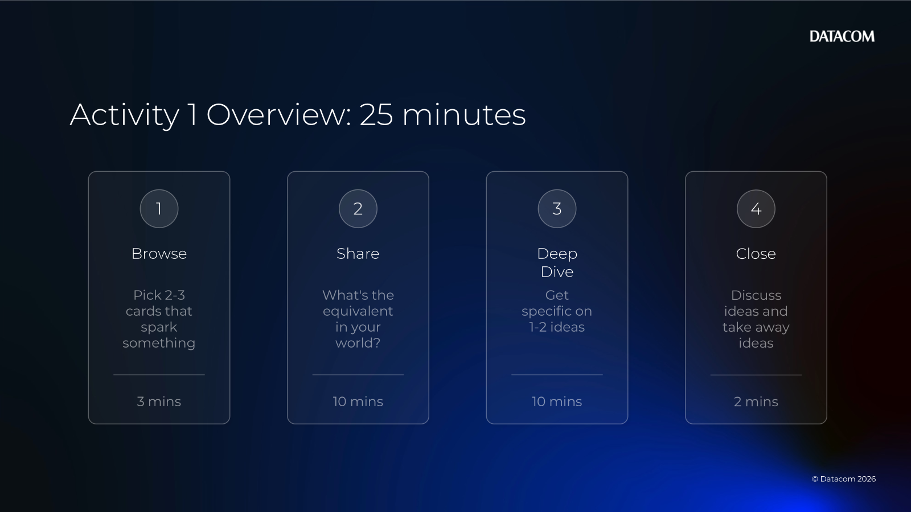
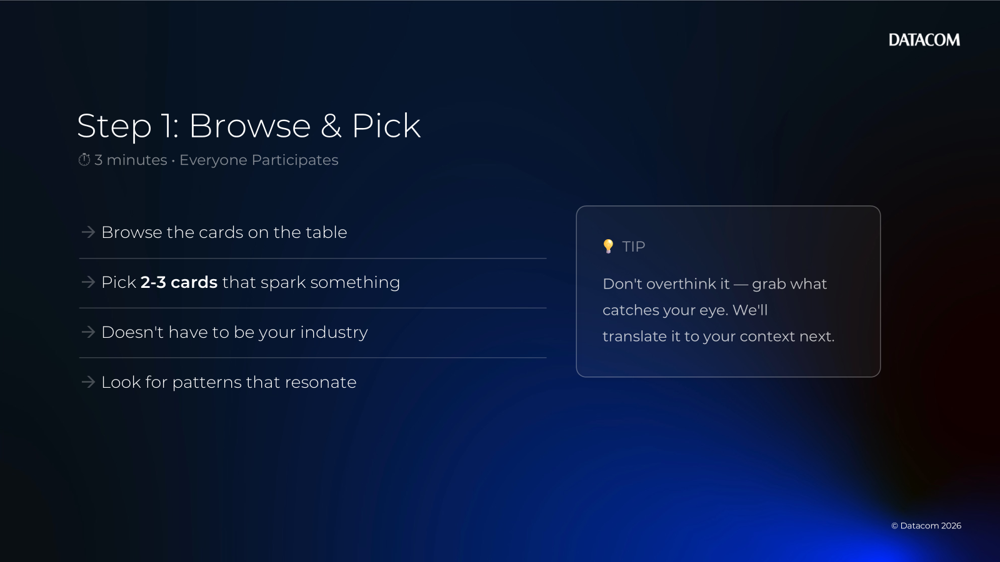
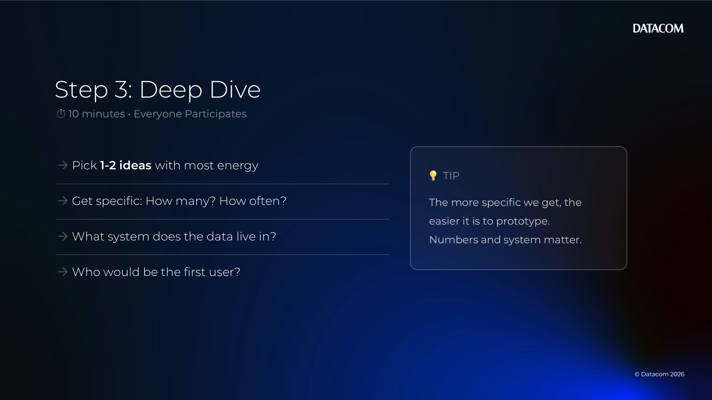

# Chapter 01 — Use Case Discovery (Cards)

[Back to all lab instructions](../../LAB_INSTRUCTIONS.md)

**Duration**: ~30 minutes (facilitated)

## Goal

Use the Chapter 1 use-case cards to identify **2–3 AI opportunities**, then translate them into **1–2 specific, testable use cases** you could prototype in the Datacom AI Sandpit.

## Learning outcomes

By the end of this activity you can:

- Rapidly scan for relevant AI opportunities (even outside your industry)
- Translate a “card prompt” into a use case in your own context
- Pressure-test a use case with basic scoping questions (volume, frequency, systems, users)
- Leave with 1–2 candidate use cases with a clear “next step”

## Prerequisites

| Item | Notes |
|---|---|
| Use-case cards | Printed (ideal) or viewed on screen via the HTML cards |
| Capture method | Whiteboard, sticky notes, or a shared doc |
| Timebox | Keep to the time windows to avoid getting stuck early |

> Facilitator note: This is a discovery activity — the goal is clarity and momentum, not perfect requirements.

---

## Activity steps

### 0) Get set up

- [ ] Open the cards: [Chapter01/Activities/Chapter1ActivityCards.html](Chapter1ActivityCards.html)
- [ ] If printing, print at 100% scale and cut cards (or print multiple pages and share per table).
- [ ] Decide how you’ll capture ideas (whiteboard / shared notes).

---

### 1) Browse (0–3 minutes) — pick 2–3 cards

- [ ] Spread cards out (or scroll quickly if using the HTML).
- [ ] Each participant grabs **2–3 cards** that spark interest.
- [ ] Don’t overthink industry matching — the card is a prompt.

Tip: Use the dots on cards as a quick filter:
- 🔴 **Complexity**: 1 dot = quicker win; 3 dots = more integration/data work
- 🟢 **Value**: 1 dot = incremental; 3 dots = strategic / significant ROI

---

### 2) Share & Translate (3–13 minutes)

For each selected card, do a fast round of discussion.

- [ ] Share the card with the group.
- [ ] Answer:
  - [ ] “Why did this catch your eye?”
  - [ ] “What’s the equivalent in your world?”
  - [ ] “Who feels this pain most?”
- [ ] Capture candidate use cases as short, concrete statements.

Capture format (copy/paste):

| Field | Notes |
|---|---|
| Use case name | Short and memorable |
| Who is it for? | Role/team (the first user) |
| What problem? | The pain / friction |
| What outcome? | Time saved, quality improved, risk reduced |
| Where is the data? | System(s) / documents / tools |

> Tip: The card is just a prompt — the gold is translating it into your specific context.

---

### 3) Deep Dive (13–23 minutes) — pick 1–2 ideas and probe

Choose **1–2** of the strongest ideas (highest energy + feasible) and push for specifics.

- [ ] Get specific:
  - [ ] “How many per week/month?”
  - [ ] “How often does this happen?”
  - [ ] “Which system does the data live in?”
- [ ] Identify the first user / champion:
  - [ ] “Who would use this first?”
- [ ] Size the benefit:
  - [ ] “If this was 30% faster/better, what would that unlock?”

If you’re tight on time: cut deep dive to 5 minutes and go deep on **one** use case.

---

### 4) Close (23–25 minutes) - Take Away Exercise - Done after training day

- [ ] Decide on **one** use case to take forward.
- [ ] Define the smallest test (2-week “sandpit-sized” experiment):
  - [ ] What’s the simplest version that proves value?
  - [ ] What does success look like?
- [ ] Capture ownership:
  - [ ] Who will provide data?
  - [ ] Who will review outputs?
  - [ ] What’s the next meeting / checkpoint?

Suggested closing questions:
- “Which ONE use case would you most like to see working?”
- “What data would you need to provide to make this prototype real?”

---

## Optional facilitator prompts

For more probing questions and timeboxing guidance, see:
- [Chapter01/Activities/Chapter1ActivityFacilitatorCheatSheet.html](Chapter1ActivityFacilitatorCheatSheet.html)

**Activity completed**
