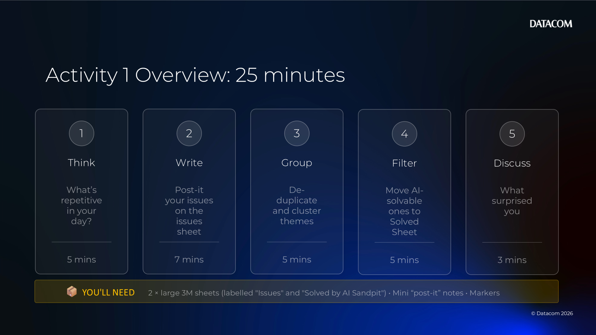
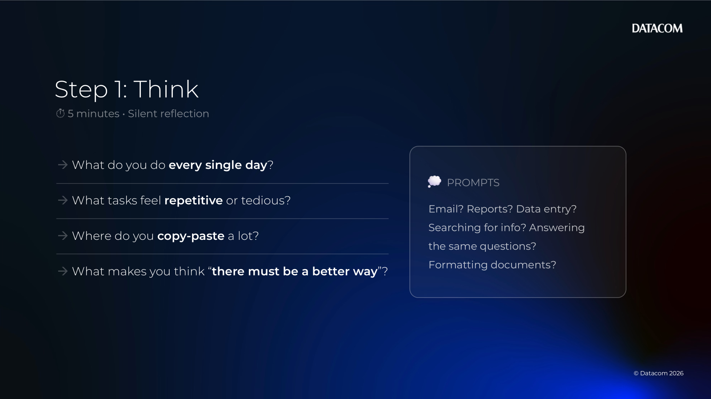
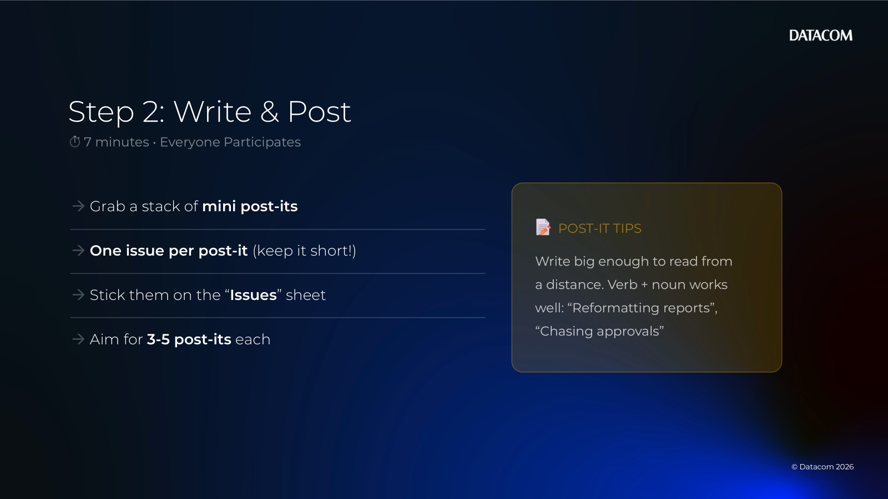
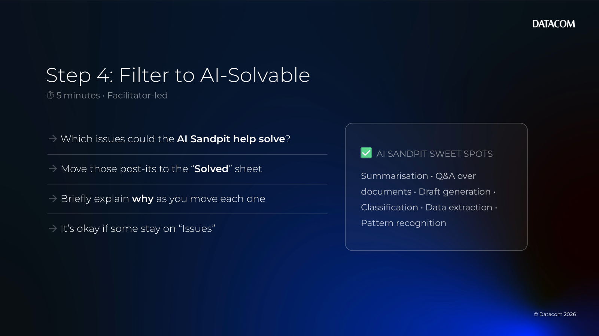
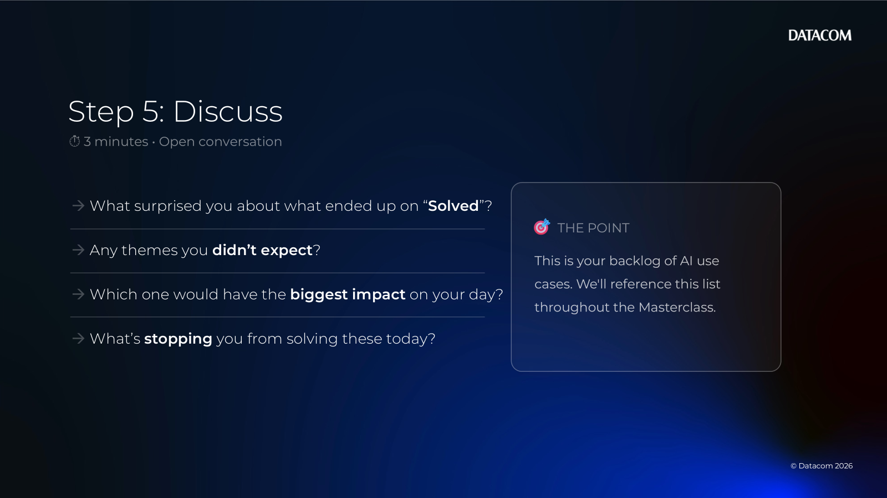

# Chapter 02 — Activity 1 (Issues → AI-solvable)

[Back to all lab instructions](../../LAB_INSTRUCTIONS.md)

**Duration**: ~25 minutes (facilitated)

## Goal

Identify repetitive/frustrating work in your day, then filter down to a short list of problems that are plausibly **AI-solvable** and worth exploring in the Datacom AI Sandpit.

## Learning outcomes

By the end of this activity you can:

- Surface and articulate recurring “pain points” as clear problem statements
- Cluster duplicates into themes to reveal the biggest friction areas
- Apply a first-pass filter for “AI-solvable” vs “not a good fit (yet)”
- Leave with a prioritised set of candidate problems to discuss/prototype

## Prerequisites

| Item | Notes |
|---|---|
| 2 × large 3M sheets | Label one **“Issues”** and one **“Solved by AI Sandpit”** |
| Mini post-it notes | One issue per note |
| Markers | Thick enough to read from a distance |
| Timebox | Keep to the time windows to maintain momentum |

---

## Activity steps

### 1) Think (0–5 minutes) — What’s repetitive in your day?

- [ ] Individually reflect on your day/week.
- [ ] Focus on work that is:
  - repetitive, manual, and frequent
  - information-heavy (reading, summarising, searching, drafting)
  - slow because you’re switching systems or chasing context
  - error-prone due to copy/paste or inconsistent rules

Prompt ideas:
- “What do you dread doing each week?”
- “Where do we lose time hunting for the right info?”
- “What do we redo because something was missed?”

---

### 2) Write (5–12 minutes) — Post-it your issues on the Issues sheet

- [ ] Write **one issue per post-it**.
- [ ] Keep it specific and observable (avoid vague labels like “process”).

Suggested format (copy/paste):

| Field | Example |
|---|---|
| Task / pain | “Summarise customer emails into a case note” |
| Who feels it | “Service desk agent” |
| Frequency / volume | “~40/day” |
| Inputs | “Emails, attachments, CRM history” |
| Output today | “Case notes, tags, next-step actions” |

- [ ] Place each post-it onto the large sheet labelled **“Issues”**.

---

### 3) Group (12–17 minutes) — De-duplicate and cluster themes

- [ ] As a group, scan the Issues sheet.
- [ ] Combine duplicates (keep one “best wording” post-it).
- [ ] Cluster similar issues into themes (e.g., “customer comms”, “reporting”, “knowledge search”).
- [ ] Optionally label each cluster with a short theme name.

---

### 4) Filter (17–22 minutes) — Move AI-solvable ones to “Solved by AI Sandpit”

- [ ] For each cluster/theme, ask:
  - [ ] Is there a clear input (documents/text/data) and output?
  - [ ] Would a *first draft* or *assistive suggestion* be valuable?
  - [ ] Can we test this safely with non-sensitive or synthetic data?
  - [ ] Is a human-in-the-loop acceptable (review/approve)?

- [ ] Move the most AI-solvable post-its to the large sheet labelled **“Solved by AI Sandpit”**.

Tip: You’re not proving feasibility here — you’re selecting candidates that are worth exploring.

---

### 5) Discuss (22–25 minutes) — What surprised you?

- [ ] What themes dominated?
- [ ] What surprised you about the list?
- [ ] Which 1–2 items feel like the best “smallest test” to prototype next?

Capture:
- [ ] Top 1–2 candidate problems
- [ ] Who would be the first user / reviewer
- [ ] What data/documents you’d need to test

---

## Optional facilitator prompts

- “If we could cut this time by 30%, what changes?”
- “What does ‘good enough’ output look like for a first test?”
- “What’s the lowest-risk version we can trial?”
- “What data is *allowed* to be used for a prototype?”

**Activity completed**
