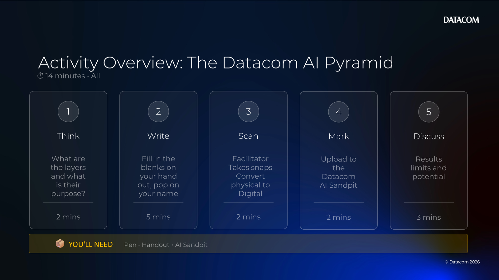
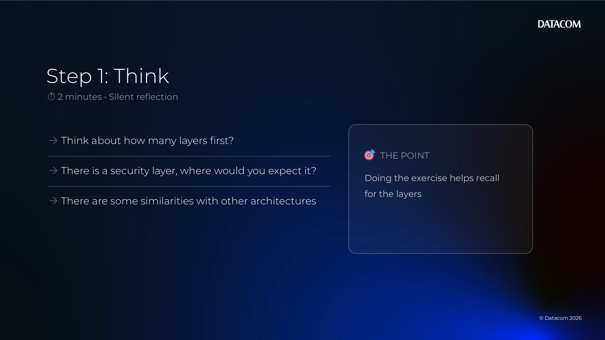
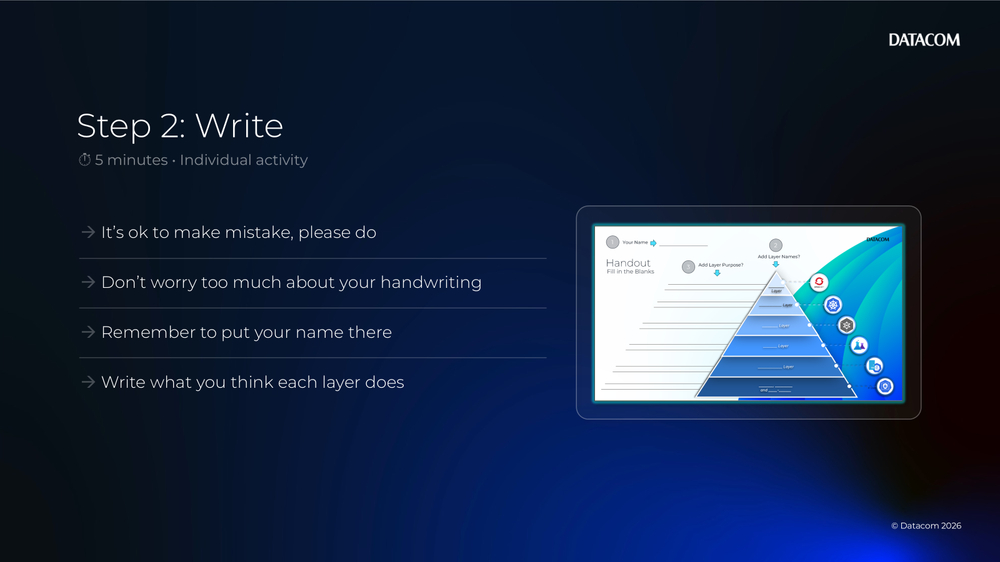
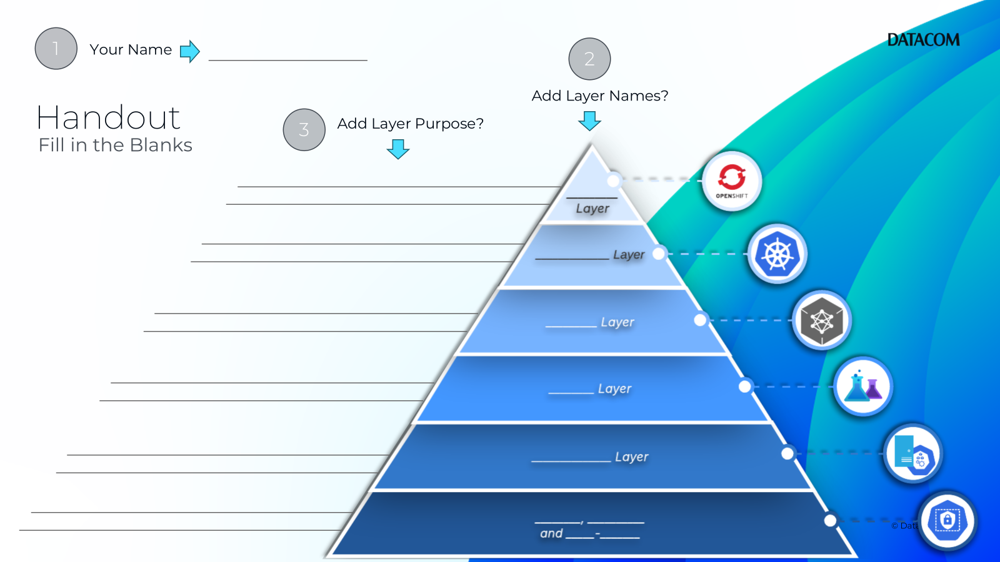
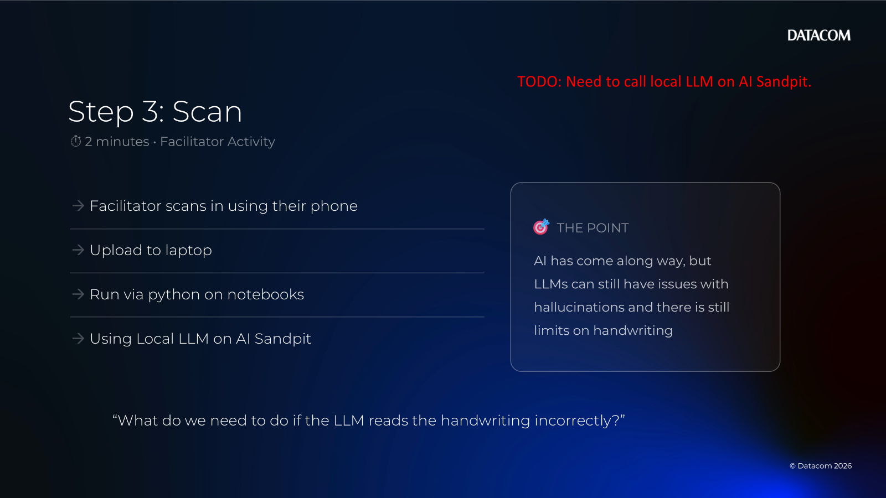
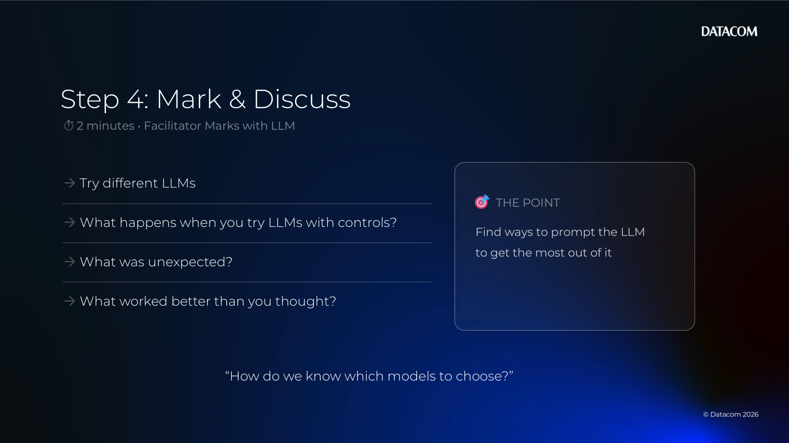
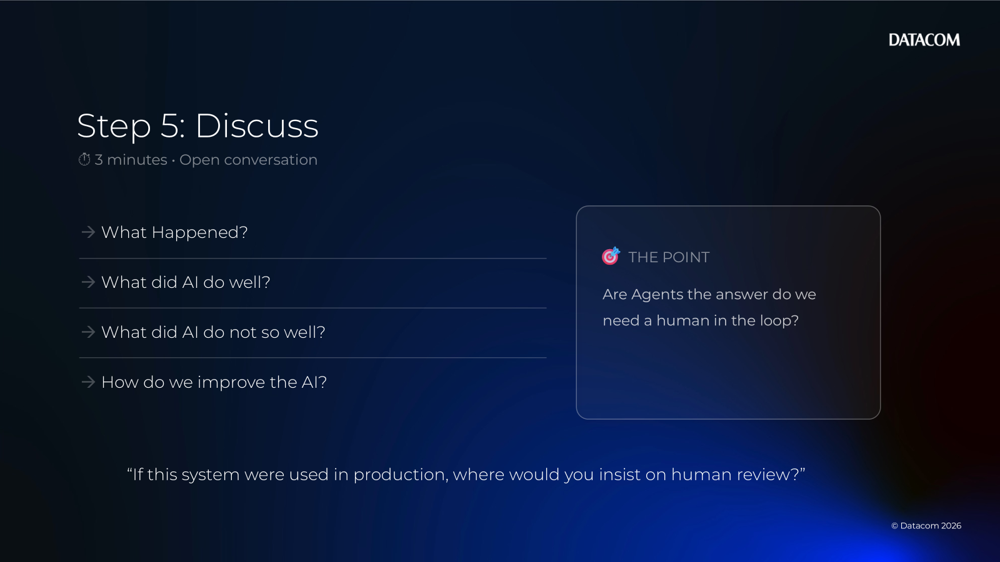
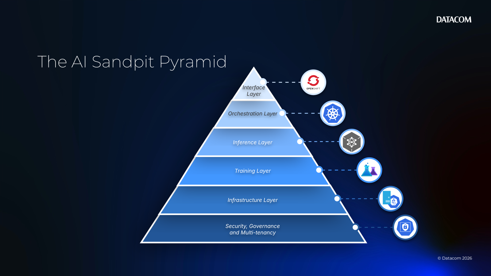

# Chapter 03 — Activity 1 (What are the layers?)

[Back to all lab instructions](../../LAB_INSTRUCTIONS.md)

**Duration**: ~14 minutes (facilitated)

## Goal

Use the pyramid handout to generate handwritten inputs, then observe how well the AI scans/interprets them so students learn how to improve input quality (clarity, structure, and formatting).

## Learning outcomes

By the end of this activity you can:

- Describe the purpose of each layer in the Datacom AI Pyramid (at a high level)
- Evaluate how well the AI reads handwritten/visual inputs
- Identify input patterns that improve AI extraction (legibility, spacing, structure, labels)
- Explain where human review is needed when using AI on scanned inputs

## Prerequisites

| Item | Notes |
|---|---|
| Pyramid handout | Printed (best) so participants can write on it |
| Pen | One per participant |
| Capture method | Camera/scan + upload to the Datacom AI Sandpit (or shared folder) |
| Timebox | Keep to the time windows to maintain momentum |

> Facilitator note: Don’t “teach” the pyramid first — the point isn’t perfect answers. The goal is to see how the AI performs on real handwritten inputs, then discuss how to adjust inputs to improve results.

---

## Activity steps

### 1) Think (0–2 minutes) — what are the layers and what is their purpose?

- [ ] Individually scan the pyramid and the icons.
- [ ] Based on what you’ve learned so far, guess the **layer names**.
- [ ] For each layer, write a short purpose statement:
  - [ ] What does this layer provide?
  - [ ] Who uses it?
  - [ ] What problem does it solve?

---

### 2) Write (2–7 minutes) — fill in the handout

- [ ] Write your name on the handout.
- [ ] Fill in the layer names.
- [ ] Add a short purpose statement for each layer (1–2 lines).

Tip prompts:
- “If this layer disappeared, what would break?”
- “What capability does this layer hide/simplify?”
- “What does this layer need from the layer below?”

---

### 3) Scan (7–9 minutes) — convert physical to digital

- [ ] Take a photo/scan of your completed handout.
- [ ] Just write naturally, mistakes will be interesting
- [ ] If you’re working in groups, include all names.

---

### 4) Mark (9–11 minutes) — upload to the Datacom AI Sandpit

- [ ] Facilitator Uploads your photo to the agreed location (Datacom AI Sandpit / shared folder).
- [ ] Use a consistent filename (suggested):

  `Chapter03_AI_Pyramid_<TeamOrName>_<YYYY-MM-DD>.png`

---

### 5) Discuss (11–14 minutes) — what did you notice?

- [ ] Compare results between pairs/tables:
  - [ ] How well did the AI read your handwriting and layout?
  - [ ] What did the AI get right?
  - [ ] What did the AI misunderstand or miss?
  - [ ] Which inputs seemed to improve results (printing, spacing, neatness, darker pen)?
- [ ] Discuss as a whole group:
  - [ ] If you were redoing it for higher accuracy, what would you change in your handout?
  - [ ] What does this tell you about how to format inputs for AI (clarity, structure, labels)?

Optional closing questions:
- “If this system were used in production, where would you insist on human review?”
- “What input guidance should we give users so the AI performs better?”
- “What layer(s) did you use in this exercise?”

---

## Facilitator notes (optional)

- Keep people moving — this is a fast alignment activity.
- If participants get stuck naming layers, redirect to purpose: “What does this part *do*?”
- Use the follow-on lab to ground the discussion in hands-on experience.

### Answer key (optional)

Canonical layer names (top → bottom):

- Interface Layer
- Orchestration Layer
- Inference Layer
- Training Layer
- Infrastructure Layer
- Security, Governance and Multi-tenancy

**Activity completed**
