# Chapter 03 — Red Hat OpenShift Lab (CLI + Jupyter)

[Back to all lab instructions](../../LAB_INSTRUCTIONS.md)

**Duration**: ~20 minutes (hands-on)

## Goal

Set up your first **Project**, **Pod**, and a **workspace** so you can run **Jupyter Notebooks** for your first Python script.

## Learning outcomes

By the end of this lab you can:

- Log in to the OpenShift console
- Navigate the Developer Console
- Open the built-in CLI terminal and run basic `oc` commands
- Create (or request access to create) the resources needed for a Jupyter-based workspace

## Prerequisites

| Item | Notes |
|---|---|
| OpenShift access | Cluster URL + credentials |
| Permissions | Ability to create or be granted access to a project/namespace |

> Facilitator note: If students cannot create resources, pre-create projects or ensure they have the right RBAC before the session.

---

## Lab steps


### 1) Log in to OpenShift

- [ ] Open the OpenShift console in your browser.

- [ ] Sign in with your provided credentials to the Axis Portal (Datacom Training) or other portal (Customer Training), then choose **AI Lab - OpenShift Console (Web)**.

    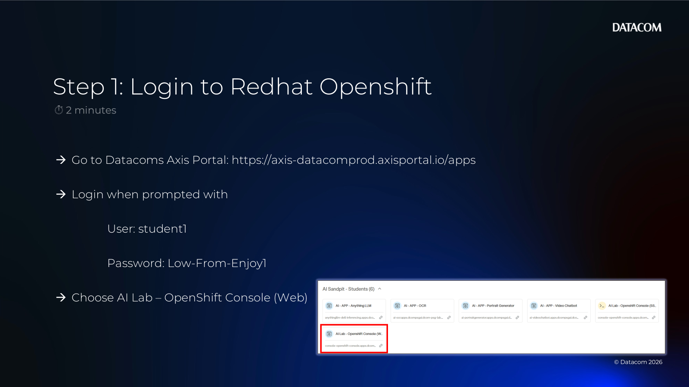

- [ ] Sign in with your provided credentials to AI Lab - OpenShift Console (Web).

    

---

### 2) Take the guided tour (Developer Console)

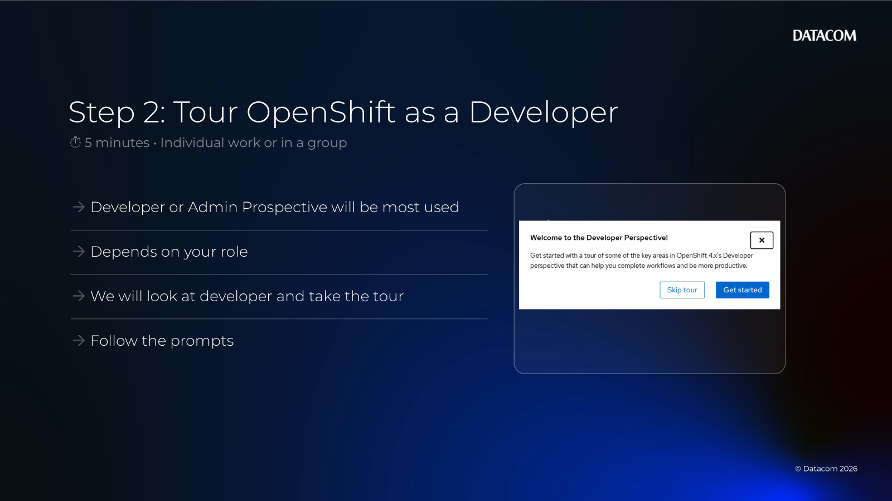

When prompted, click **Get started** to begin the tour.

- [ ] Start the tour and click through the next few pop-up screens.

    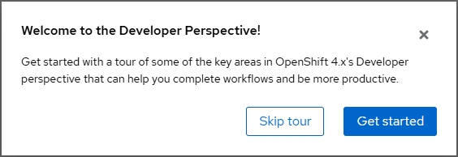

- [ ] Click **Next** through the tour screens.
- [ ] Pay attention to the different **Perspectives** (Administrator vs Developer).

    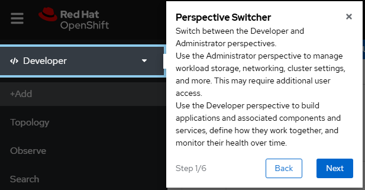

Along the way you’ll see:
- Where to find metrics about application performance.

    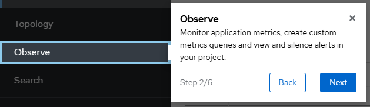
- How to search and list resources in your project.

    
- How to use command line tools (CLI) to create and check on resources.

    
- Where to get help for quick starts, restarting the tour, deploying applications, etc.

    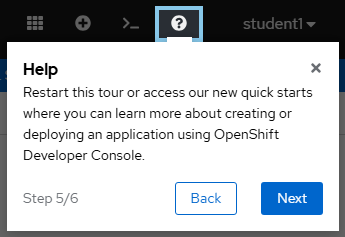
- Where to set up your preferences (default views, colour, etc.).

    

- [ ] Finish the tour (**Okay, got it**).

    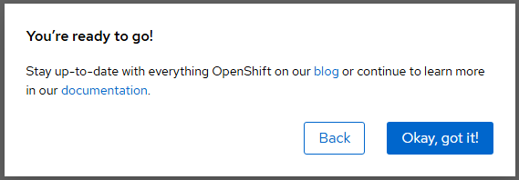

### 3) Create your project (via GUI or CLI)
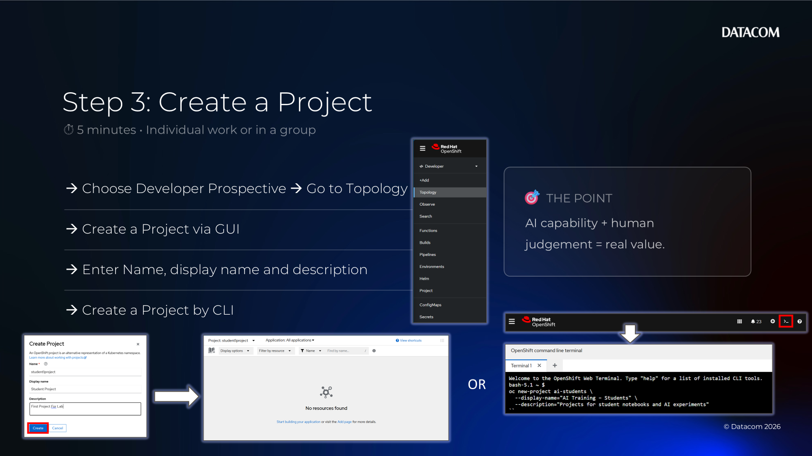

**GUI option**

- [ ] Go to **Developer** perspective.

    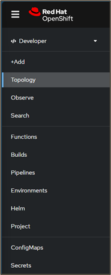

- [ ] Create a **Project**, enter name, display name and description and click Create

    

- [ ] Your project has been created

    

**CLI option**
- [ ] You can also create a project via the Command Line Interface (CLI). 
      Start with the CLI Button from the top left menu.

    
    

- [ ] Type the ```oc new-project``` command in the CLI and hit enter

    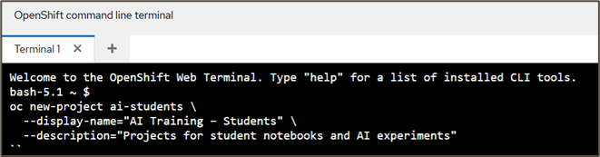

    ```bash
    oc new-project ai-students \
    --display-name="AI Training – Students" \
    --description="Projects for student notebooks and AI experiments"
    ```

- [ ] Review your project here in Developer Prespective --> Project.

    

- [ ] See your project information and metrics

    

### 4) Create a Workbench with a Jupyter Image


- [ ] Give the workbench a name like `Study1`, provide a description and choose and image 
    

- [ ] Image Options - choose one with Jupyter, Data Science for eg.

    

- [ ] You can also choose the version of python

    

- [ ] Leave everything else as default - deployment size, accelerator

    

- [ ] Environment variables, cluster storage and connections

    

- [ ] Click **Create Workbench**.

    

- [ ] Wait for the project to be created.

    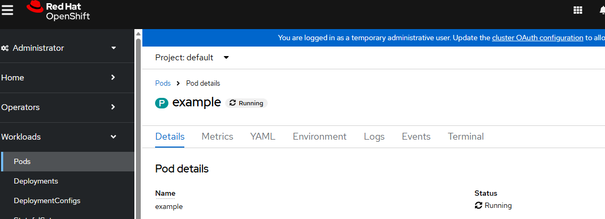

- [ ] Your project is not created and listed.

    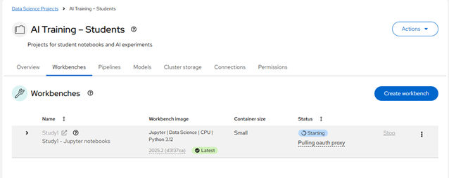

### 5) Explore Jupyter Notebooks


- [ ] From your previous step 4, choose the Project Workbench

    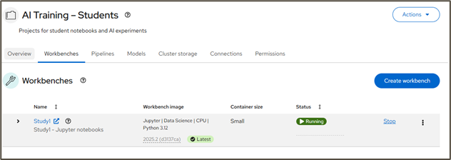

- [ ] and click on the Workbench (Study1)

    

- [ ] Choose Python Notebook

    

- [ ] Write some code, rename the file, create and move cells, experiment with code

    

**Lab Completed**
