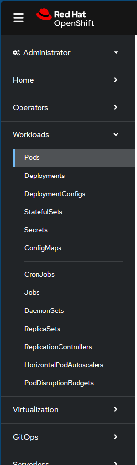
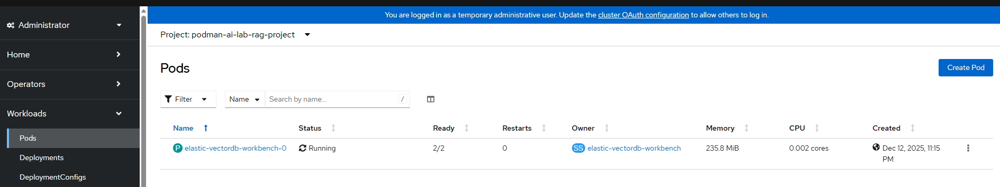
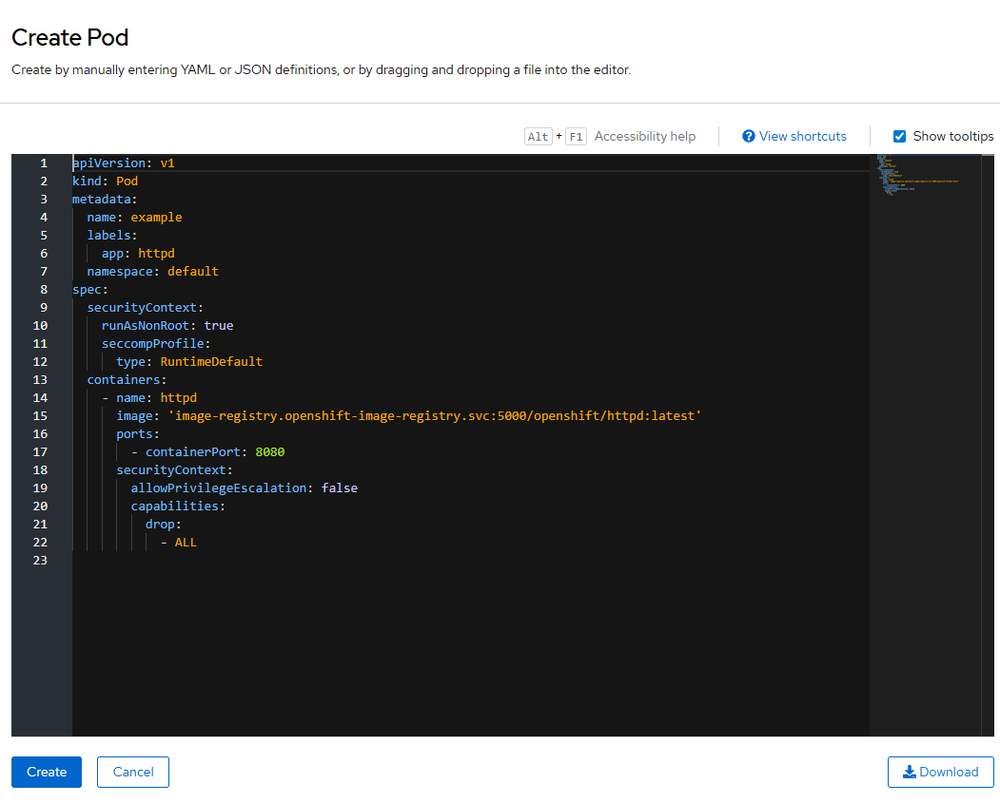
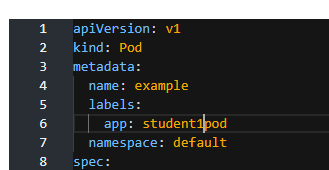
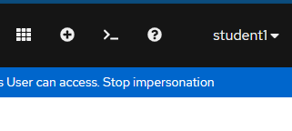
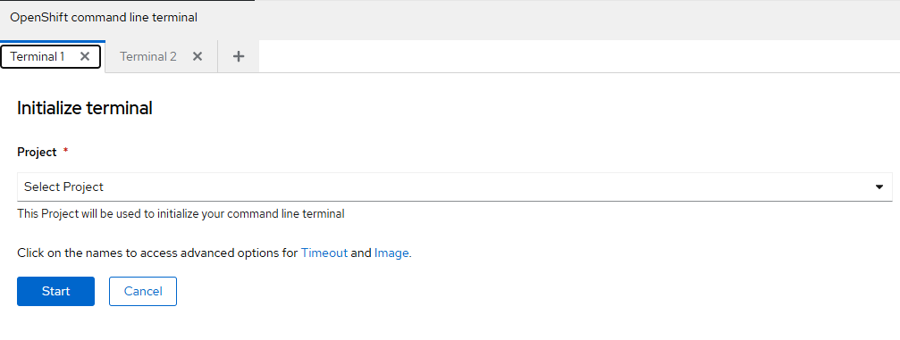

# Chapter 03 — Red Hat OpenShift Lab (CLI + Jupyter)

[Back to all lab instructions](../../LAB_INSTRUCTIONS.md)

**Duration**: ~20 minutes (hands-on)

## Goal

Set up your first **Project**, **Pod**, and a **workspace** so you can run **Jupyter Notebooks** for your first Python script.

## Learning outcomes

By the end of this lab you can:

- Log in to the OpenShift console
- Navigate the Developer Console
- Open the built-in CLI terminal and run basic `oc` commands
- Create (or request access to create) the resources needed for a Jupyter-based workspace

## Prerequisites

| Item | Notes |
|---|---|
| OpenShift access | Cluster URL + credentials |
| Permissions | Ability to create or be granted access to a project/namespace |

> Facilitator note: If students cannot create resources, pre-create projects or ensure they have the right RBAC before the session.

---

## Lab steps


### 1) Log in to OpenShift

- [ ] Open the OpenShift console in your browser.

- [ ] Sign in with your provided credentials to the Axis Portal (Datacom Training) or other portal (Customer Training), then choose **AI Lab - OpenShift Console (Web)**.

  

- [ ] Sign in with your provided credentials to AI Lab - OpenShift Console (Web).

  

---

### 2) Take the guided tour (Developer Console)


When prompted, click **Get started** to begin the tour.

- [ ] Start the tour and click through the next few pop-up screens.

  

- [ ] Click **Next** through the tour screens.
- [ ] Pay attention to the different **Perspectives** (Administrator vs Developer).

  

Along the way you’ll see:
- Where to find metrics about application performance.


- How to search and list resources in your project.


- How to use command line tools (CLI) to create and check on resources.


- Where to get help for quick starts, restarting the tour, deploying applications, etc.


- Where to set up your preferences (default views, colour, etc.).


- [ ] Finish the tour (e.g., **Okay, got it**).

  

### 3) Create your project and pod (via GUI or CLI)
**GUI option**

- [ ] Go to **Administrator** perspective.
  

- [ ] Go to **Workloads** → **Pods**.
  

- [ ] Click **Create Pod**.
  

- [ ] Review (and optionally edit) the YAML that is shown.
  

- [ ] Give the pod a name like `student1pod` (use your student number).
  

- [ ] Review the right-hand schema/help panel (optional).
- [ ] Click **Create**.
  

- [ ] Wait for the pod to be created.
  

- [ ] Confirm the status changes from **Pending/ContainerCreating** to **Running**.

**CLI option**

Open the built-in terminal:

- [ ] Click the `>_` icon (top-right) to open the **Command Line Interface**.

  

At the bottom of the screen you should see a terminal area.



This is where you run `oc` commands to create and manage resources.

Run a few basic commands (replace `1` with your student number):

```bash
oc whoami
oc project

# Create (or switch to) your project/namespace
oc new-project student1

# Create a simple pod
oc run student1pod --image=registry.access.redhat.com/ubi9/ubi --restart=Never

# Check status
oc get pods
```

Tip: the exact pod command is also in `oc-commands` in this folder.

> If you see a **forbidden** or permissions error: ask your facilitator/admin to grant access or provide a pre-created project for you.

---

### 4) Create your Jupyter workspace

- [ ] Create your workspace using an image that includes Jupyter Notebooks.

> Facilitator note: Add the exact steps for your environment here (OpenShift AI / Workbenches / image name / size limits / project naming conventions).

---

### 5) Explore Jupyter Notebooks

- [ ] Launch Jupyter.
- [ ] Create a notebook.
- [ ] Run a first Python cell.


---

## Save your work

- [ ] Save your notes in this folder (or a file like `my-notes.md`).

## Deliverables

- Notes or screenshots showing you successfully logged in and accessed the CLI terminal
- (Optional) Evidence of a running Jupyter workspace/notebook
