# Chapter 03 — Red Hat OpenShift Lab (CLI + Jupyter)

[Back to all lab instructions](../../LAB_INSTRUCTIONS.md)

**Duration**: ~20 minutes (hands-on)

## Goal

Set up your first **Project**, **Pod**, and a **workspace** so you can run **Jupyter Notebooks** for your first Python script.

## Learning outcomes

By the end of this lab you can:

- Log in to the OpenShift console
- Navigate the Developer Console
- Open the built-in CLI terminal and run basic `oc` commands
- Create (or request access to create) the resources needed for a Jupyter-based workspace

## Prerequisites

| Item | Notes |
|---|---|
| OpenShift access | Cluster URL + credentials |
| Permissions | Ability to create or be granted access to a project/namespace |

> Facilitator note: If students cannot create resources, pre-create projects or ensure they have the right RBAC before the session.

---

## Lab steps

### 1) Log in to OpenShift

- [ ] Open the OpenShift console in your browser.

- [ ] Sign in with your provided credentials.

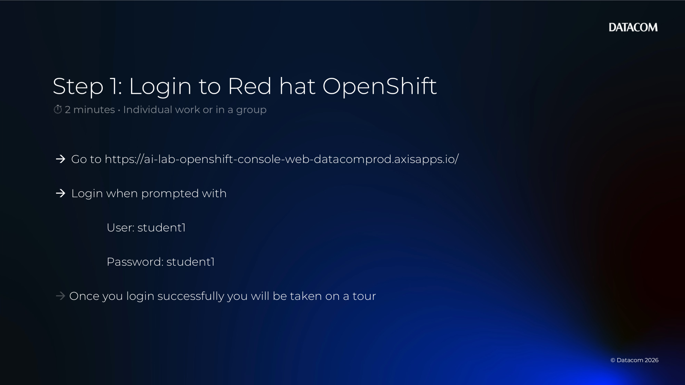

---

### 2) Take the guided tour (Developer Console)

When prompted, click **Get started** to begin the tour.

- [ ] Start the tour.

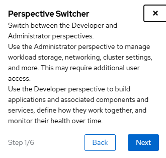

- [ ] Click **Next** through the tour screens.
- [ ] Pay attention to the different **Perspectives** (Administrator vs Developer).

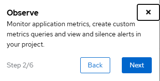

Along the way you’ll see where to:

- Find metrics about application performance

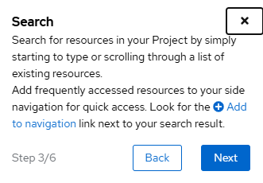

- Search and list resources in your project

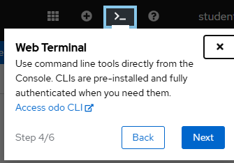

- Use either the UI or CLI to create resources (pods/projects/workspaces)

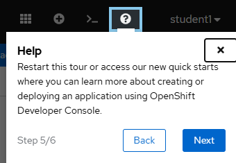

- Access help and documentation

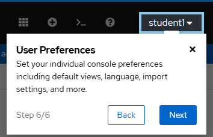

- Configure user preferences (views/language/import settings)

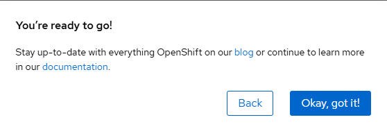

- [ ] Finish the tour (e.g., **Okay, got it**).

---

### 3) Create your project and pod (via CLI)

Open the built-in terminal:

- [ ] Click the `>_` icon (top-right) to open the **Command Line Interface**.

At the bottom of the screen you should see a terminal area.

This is where you run `oc` commands to create and manage resources.

- [ ] Select the correct **Project** from the dropdown.

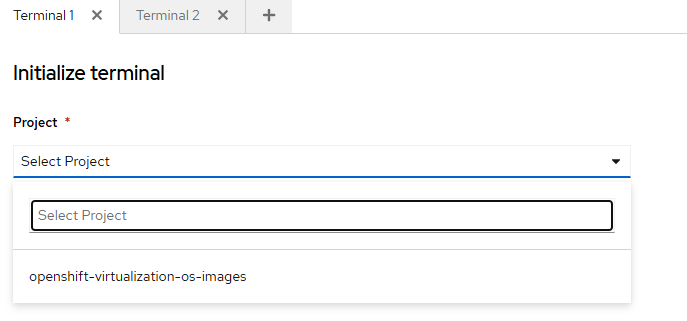

- [ ] Click **Start**.

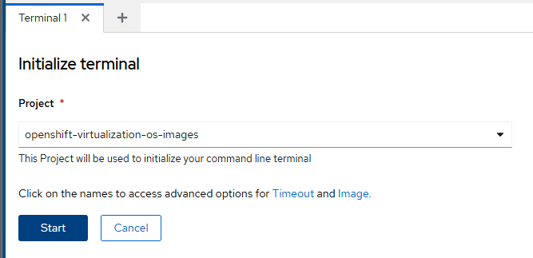

If you see an error about permissions, you may not have rights to create resources.

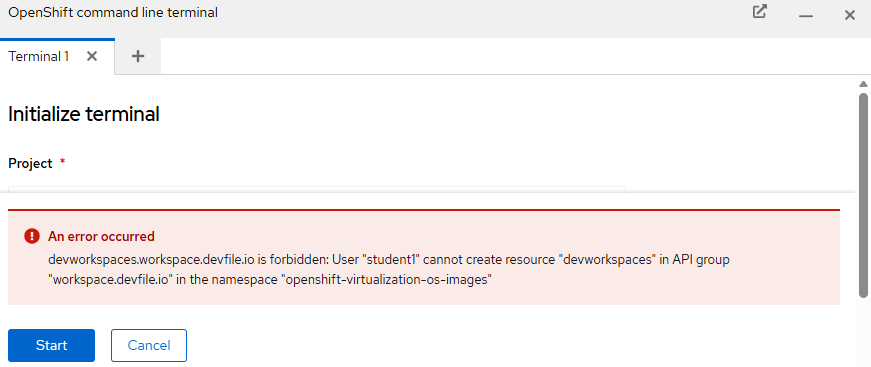

> If you hit this error: ask your administrator/facilitator to grant access or provide a pre-created project for you.

---

### 4) Create your Jupyter workspace

- [ ] Create your workspace using an image that includes Jupyter Notebooks.

> Facilitator note: Add the exact steps for your environment here (OpenShift AI / Workbenches / image name / size limits / project naming conventions).

---

### 5) Explore Jupyter Notebooks

- [ ] Launch Jupyter.
- [ ] Create a notebook.
- [ ] Run a first Python cell.

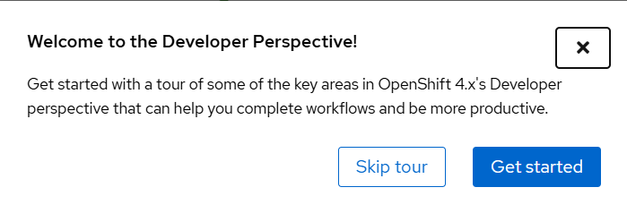

---

## Save your work

- [ ] Save your notes in this folder (or a file like `my-notes.md`).

## Deliverables

- Notes or screenshots showing you successfully logged in and accessed the CLI terminal
- (Optional) Evidence of a running Jupyter workspace/notebook
