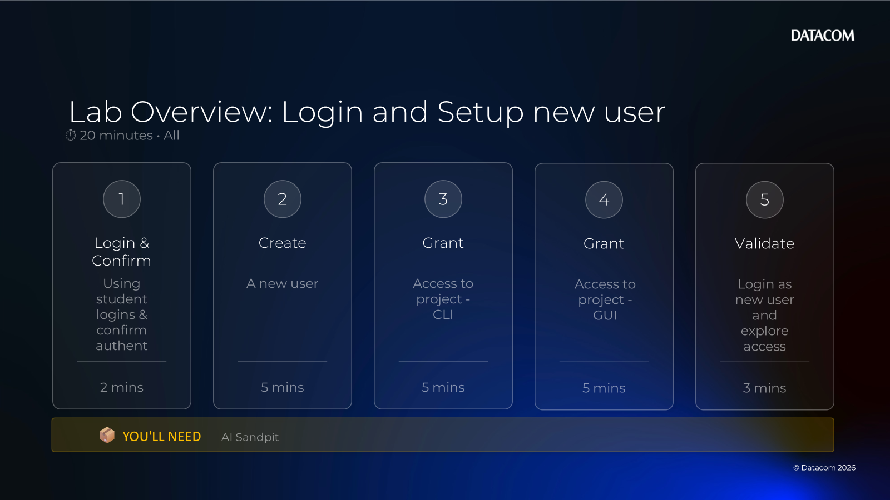
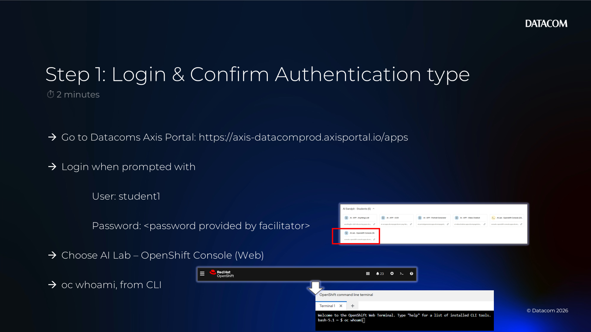
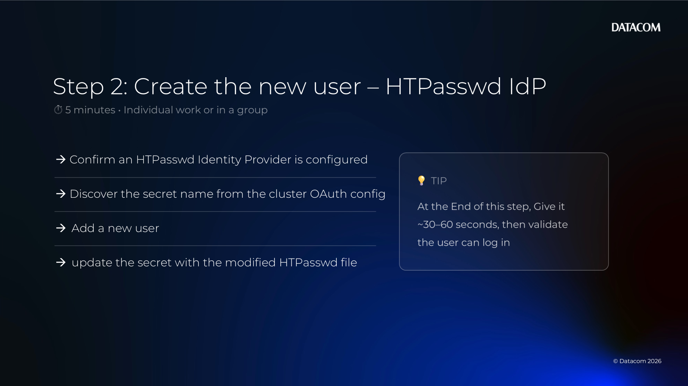
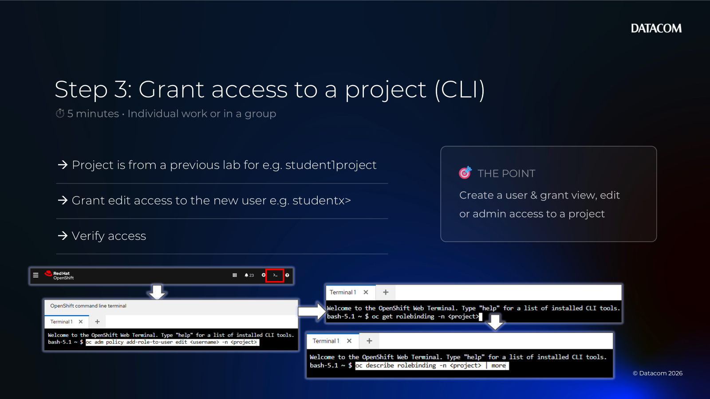
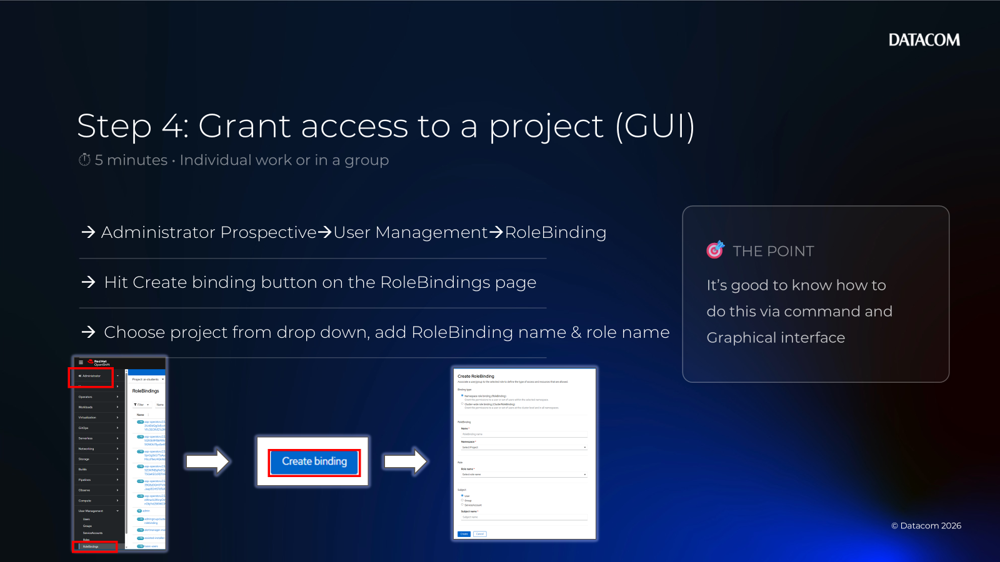
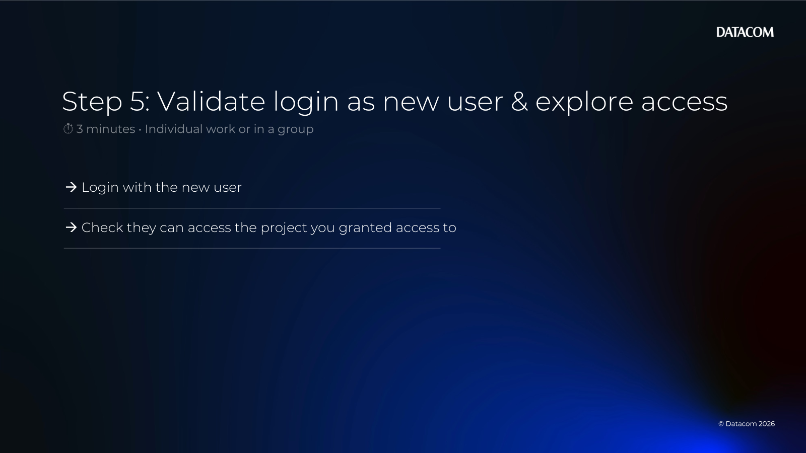

# Chapter 04 — Lab 1: Create a New User + Grant Access (OpenShift)

[Back to all lab instructions](../../LAB_INSTRUCTIONS.md)

**Duration**: ~20 minutes (hands-on)

## Goal

Create a new OpenShift login (e.g., `studentx`) and then onboard that user into a shared environment by granting the right access to a project/namespace and validating they can log in and work.

## Learning outcomes

By the end of this lab you can:

- Create a user identity suitable for lab logins
- Add a user (or identity) to a project
- Assign an appropriate role (view/edit/admin)
- Validate access via the OpenShift console and/or `oc`

## Prerequisites

| Item | Notes |
|---|---|
| OpenShift access | Cluster URL + credentials |
| Permissions | Cluster admin (to create a user identity) + project admin/edit (to grant access) |
| Target project | An existing project/namespace, or ability to create one |
| User to create | Example: `studentx` |
| If using HTPasswd IdP | Ability to edit the `openshift-config` HTPasswd secret |

> Note: In many enterprise clusters you do **not** create users in OpenShift; users come from an Identity Provider (IdP) like Entra ID/AD/LDAP. For this MasterClass we assume a **lab-friendly** approach (typically an **HTPasswd** identity provider) so you can create users like `studentx`.

---

## Lab steps

### Lab overview (timebox)



| Step | What you’ll do | Time |
|---:|---|---:|
| 1 | Login & confirm authentication (existing student login) | ~2 mins |
| 2 | Create a new user (HTPasswd) | ~5 mins |
| 3 | Grant access to a project (CLI) | ~5 mins |
| 4 | Grant access to a project (GUI) | ~5 mins |
| 5 | Validate login as the new user and explore access | ~3 mins |

---

### 1) Login & confirm authentication (existing student login)



Use an existing student login (e.g., `student1`) to confirm you can authenticate and that the cluster is ready for user creation.

- [ ] Log in to the OpenShift console using an existing student account.
- [ ] Confirm you can access the cluster and see projects.

Optional CLI sanity check:

```bash
oc whoami
```

If you don’t see an HTPasswd login option in the console, ask your facilitator which Identity Provider is configured.

---

### 2) Create the new user (HTPasswd IdP)



This step updates the HTPasswd file stored in a secret in the `openshift-config` namespace.

`oauth/cluster` is the OpenShift *cluster login configuration* (which identity providers are enabled and how they’re configured).

Confirm an HTPasswd Identity Provider is configured:

```bash
oc get oauth cluster -o jsonpath='{range .spec.identityProviders[*]}{.type}{"\n"}{end}'
```

- If you see `HTPasswd`, continue.
- If you do not, stop here and ask your facilitator (you may need to create users in the external IdP instead).

First, discover the secret name from the cluster OAuth config (don’t guess it):

```bash
oc get oauth cluster -o jsonpath='{range .spec.identityProviders[?(@.type=="HTPasswd")]}{.htpasswd.fileData.name}{"\n"}{end}'
```

Set that value as:

- `<htpasswd-secret>` (commonly `htpass-secret`)

1) Extract the current HTPasswd file from the secret:

```bash
mkdir -p htpasswd-work
oc extract secret/<htpasswd-secret> -n openshift-config --to=htpasswd-work --confirm
```

2) Add a new user (example: `studentx`). You need the `htpasswd` utility.

```bash
htpasswd -B -b htpasswd-work/htpasswd <username> "<temporary-password>"
```

Windows notes (pick one approach):

- **WSL**: `sudo apt-get update ; sudo apt-get install -y apache2-utils` then run the `htpasswd` command inside WSL.
- **Git Bash + Apache tools**: if `htpasswd` is already available, you can run it directly.

3) Update the secret with the modified HTPasswd file:

```bash
oc create secret generic <htpasswd-secret> \
  --from-file=htpasswd=htpasswd-work/htpasswd \
  -n openshift-config \
  --dry-run=client -o yaml | oc apply -f -
```

4) Give it ~30–60 seconds, then validate the user can log in.

> Tip: Use a temporary password and rotate it later (or agree on a lab password policy with your facilitator).

---

### 3) Grant access to project (CLI)



In this MasterClass, you should already have a project from an earlier lab.

- [ ] Username: `<username>` (example: `studentx`)
- [ ] Project/namespace: use the one created earlier (example: `ai-students`)

Choose ONE role based on what the user needs:

- **view**: read-only
- **edit**: create/update most namespaced resources
- **admin**: manage project-level access + most resources

Example (recommended for most students): grant **edit** to the project:

```bash
oc adm policy add-role-to-user edit <username> -n <project>
```

Verify:

```bash
oc get rolebinding -n <project>
oc describe rolebinding -n <project> | more
```

---

### 4) Grant access to project (GUI)



- [ ] Open the OpenShift console.
- [ ] Switch to the target project.
- [ ] Go to **User Management** → **RoleBindings**.
- [ ] Create a **RoleBinding** (namespace-scoped):
  - **Binding type**: *Namespace role binding (RoleBinding)*
  - **Namespace**: your target project
  - **Role name**: start typing `edit` and select the built-in role `edit`
    - You may see a *very long list* (operators, system roles, etc.). Use the search box to filter.
    - Other common built-in options are `view` (read-only) and `admin` (project admin).
  - **Subject**: *User*
  - **Subject name**: `<username>`

---

### 5) Validate login as the new user and explore access



- [ ] Have the new user log in to the OpenShift console.
- [ ] If using HTPasswd, choose the HTPasswd login option and use the username/password you created.
- [ ] Confirm they can see the project.
- [ ] Confirm they can perform the expected action:
  - view-only: can list resources
  - edit: can create a simple resource (e.g., a ConfigMap)

Quick validation (CLI as the new user):

```bash
oc whoami
oc project <project>
oc get pods
oc create configmap hello --from-literal=msg=world
```

---

### (Optional) Bonus: confirm OpenShift created the User/Identity objects

OpenShift typically creates the `User`/`Identity` objects **after the first successful login**.

1) Find the HTPasswd identity provider name:

```bash
oc get oauth cluster -o jsonpath='{range .spec.identityProviders[?(@.type=="HTPasswd")]}{.name}{"\n"}{end}'
```

2) As an admin, verify the user exists:

```bash
oc get user <username>
```

3) Verify the identity exists (identity name is usually `<idp-name>:<username>`):

```bash
oc get identity <idp-name>:<username>
```

Windows tip (PowerShell):

```powershell
oc get identity -o name | Select-String "<username>"
```

---

## Troubleshooting

- If `oc extract secret/<htpasswd-secret>` fails, re-check the secret name from `oc get oauth cluster ...` and confirm you have cluster-admin rights.
- If the console doesn’t show an HTPasswd login option, the cluster likely isn’t configured for HTPasswd.
- If the user can log in but cannot see the project, double-check the identity string you used in the RoleBinding.
- If `oc adm policy` is denied, you may not have cluster/project admin rights.
- If your cluster uses groups, you can grant the role to a group instead of individual users (recommended for scale).

**Lab completed**
