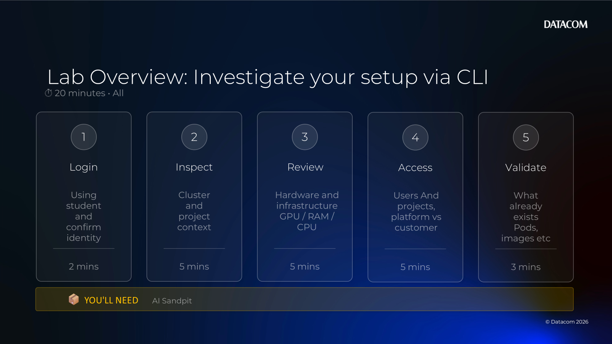
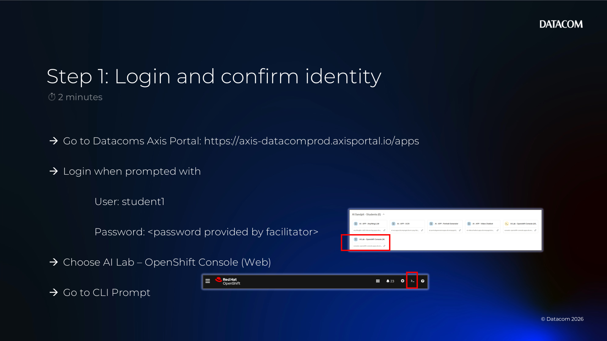
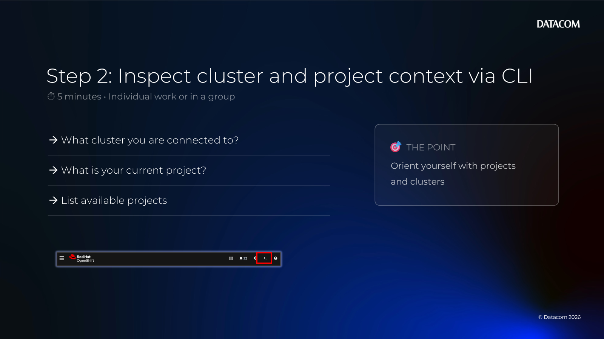
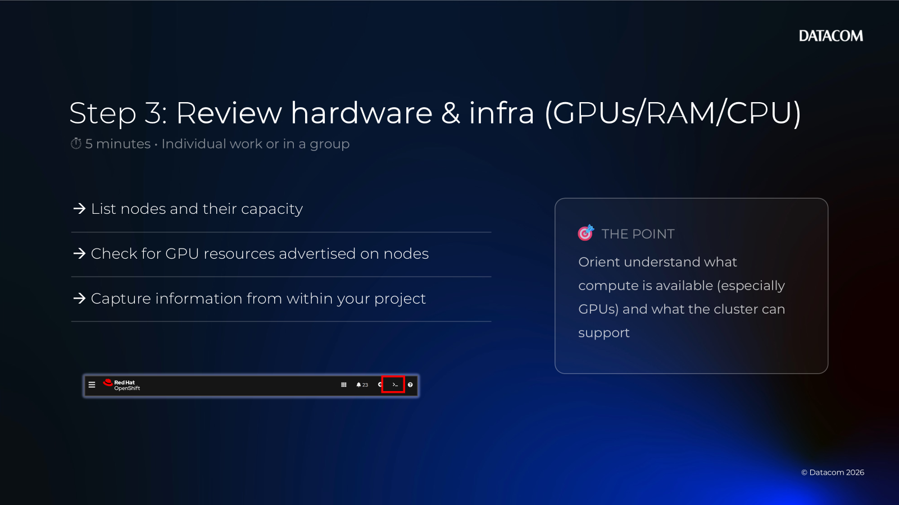
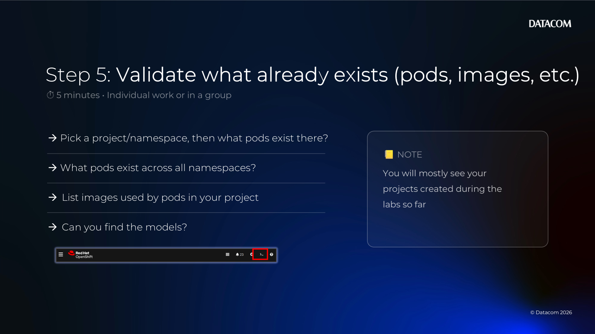

# Chapter 05 — Lab 1: Investigate Your Setup via CLI

[Back to all lab instructions](../../LAB_INSTRUCTIONS.md)

**Duration**: ~20 minutes (hands-on)

## Goal

Use the CLI to quickly understand your current environment and where you are running (cluster/project context), so you can confidently proceed with later OpenShift-based labs.

## Learning outcomes

By the end of this lab you can:

- Confirm who you are authenticated as
- Confirm which cluster and project/namespace you’re targeting
- Inspect infrastructure-relevant details (GPUs, RAM/CPU capacity, cluster/operators)
- Understand basic tenancy (users + projects) and what’s “platform” vs “customer”
- Inspect what already exists in your project (pods, images, workbenches, models)
- Capture a short “environment snapshot” for troubleshooting

## Prerequisites

| Item | Notes |
|---|---|
| OpenShift CLI | `oc` installed and available in your terminal |
| Cluster access | Cluster API/console URL + credentials |
| Permissions | At least enough to view your current project and basic resources |

---

## Lab steps

### Lab overview (timebox)



| Step | What you’ll do | Time |
|---:|---|---:|
| 1 | Login and confirm identity | ~2 mins |
| 2 | Inspect cluster and project context | ~5 mins |
| 3 | Review hardware and infrastructure (GPUs/RAM/CPU) | ~5 mins |
| 4 | Access users and projects (platform vs customer) | ~5 mins |
| 5 | Validate what already exists (pods, images, etc.) | ~3 mins |

---

### 1) Login and confirm identity



Run:

```bash
oc version
oc whoami
```

- [ ] `oc version` runs without error
- [ ] `oc whoami` returns your username

If you are not logged in, authenticate:

```bash
oc login --server=<cluster-api-url>
```

Optional: confirm your current context (helpful if you use multiple clusters):

```bash
oc config current-context
```

---

### 2) Inspect cluster and project context



Check what cluster you are connected to:

```bash
oc whoami --show-server
```

Check your current project:

```bash
oc project
```

List available projects (may require extra permissions):

```bash
oc get projects
```

- [ ] You know which project/namespace you are working in for the MasterClass

Quick “what cluster is this?” checks (permissions may vary):

```bash
oc get clusterversion
oc get clusteroperators
```

---

### 3) Review hardware and infrastructure (GPUs/RAM/CPU)



Your goal is to understand what compute is available (especially GPUs) and what the cluster can support.

List nodes and their capacity (if allowed):

```bash
oc get nodes
oc get nodes -o custom-columns=NAME:.metadata.name,CPU:.status.capacity.cpu,MEMORY:.status.capacity.memory --no-headers
```

Check for GPU resources advertised on nodes (common keys include `nvidia.com/gpu`):

```bash
oc get nodes -o jsonpath='{range .items[*]}{.metadata.name}{"\t"}{.status.allocatable.nvidia\.com/gpu}{"\n"}{end}'
```

If you don’t have node permissions (forbidden), capture what you can from within your project:

```bash
oc get quota -n <your-project>
oc get limitrange -n <your-project>
```

Windows-friendly GPU string search (fallback):

```bash
oc describe nodes | findstr /i nvidia
```

Non-Windows shells can use:

```bash
oc describe nodes | grep -i nvidia
```

---

### 4) Access users and projects (platform vs customer)


In a shared platform, you’ll often want to distinguish:

- **Platform/default projects**: `openshift-*`, `kube-*`, `default`, `redhat-*` (names vary)
- **Customer/lab projects**: projects created for teams, students, or workloads

List users (often restricted):

```bash
oc get users
```

List projects:

```bash
oc get projects
```

Quick filter to show likely platform namespaces:

```bash
oc get ns | findstr /i "openshift kube default"
```

For this MasterClass, you should mostly see the lab projects so far.

---

### 5) Validate what already exists (pods, images, etc.)



Pick your target project/namespace first:

```bash
oc project <your-project>
```

#### Pods already running

What pods exist in your project:

```bash
oc get pods
```

What pods exist across all namespaces (may be restricted and can be noisy):

```bash
oc get pods -A
```

#### Images (workbenches and other workloads)

List images used by pods in your project:

```bash
oc get pods -o jsonpath='{range .items[*]}{.metadata.name}{"\t"}{range .spec.containers[*]}{.image}{" "}{end}{"\n"}{end}'
```

Get a concrete “container example” by describing a pod:

```bash
oc describe pod <pod-name>
```

#### Workbenches

Workbenches are implemented by platform-specific resources. Depending on your setup, you may see one of these.

Try each of these (it’s OK if some return “the server doesn’t have a resource type”):

```bash
oc get notebook
oc get notebooks
oc get pod | findstr /i notebook
```

If you have OpenShift AI installed, you may also see data science specific resources:

```bash
oc get datasci -A
oc get datasciencecluster -A
```

#### Models deployed

Model serving varies by platform configuration. Common serving resources include KServe `InferenceService`.

Try:

```bash
oc get inferenceservices
oc get servingruntimes
oc get deployments
```

If a model is deployed behind a service/route, list those too:

```bash
oc get svc
oc get routes
```

---

## Environment snapshot (optional)

If you need to hand off information to a facilitator, save a small snapshot:

```bash
oc whoami > env-snapshot.txt
oc whoami --show-server >> env-snapshot.txt
oc project >> env-snapshot.txt
oc status >> env-snapshot.txt
oc get pods >> env-snapshot.txt
```

---

## What to submit

- A short note (bullet list) in your chapter notes describing:
  - your username (`oc whoami`)
  - cluster server (`oc whoami --show-server`)
  - project/namespace (`oc project`)
  - GPU + RAM signal you observed (or the fact you didn’t have node permissions)
  - number of projects you can see (`oc get projects`)
  - what pods and images already exist in your project
  - any RBAC limitations you hit (e.g., forbidden for users/nodes/operators)

## Facilitator notes (scaffolding)

- Replace `<cluster-api-url>` and project naming conventions as needed.
- If you have a standard “student project” naming pattern (e.g., `student01` → `ai-student01`), add it to Step 2.
- If you want learners to distinguish between “AI Sandpit” and “AI Sandpit Lite”, add a short note in Step 3 explaining what outputs indicate which platform.
