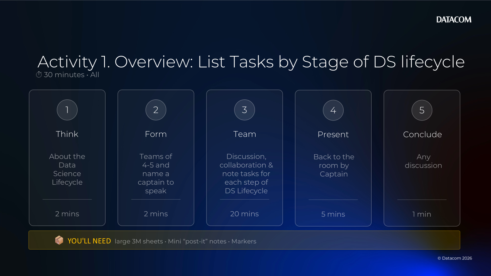
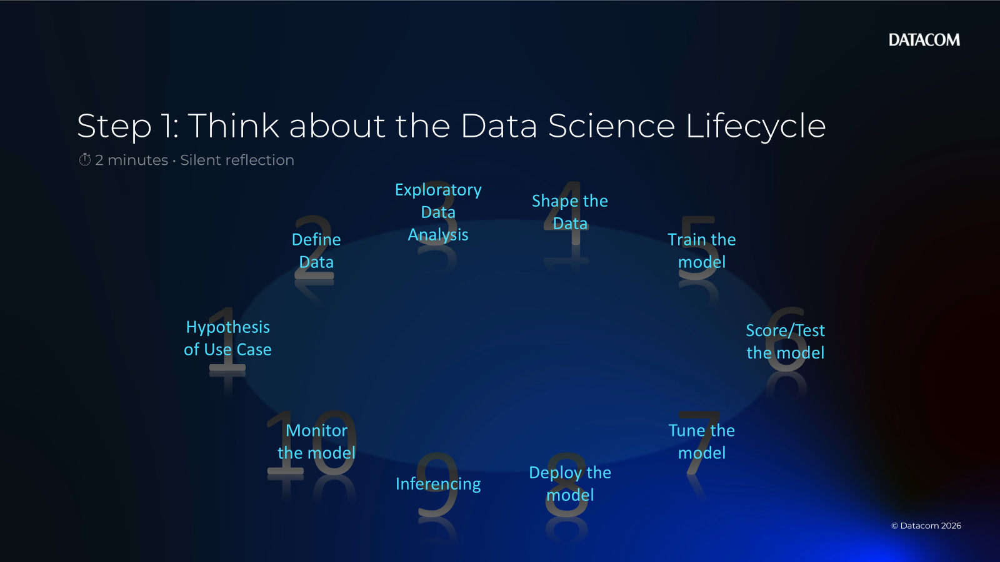
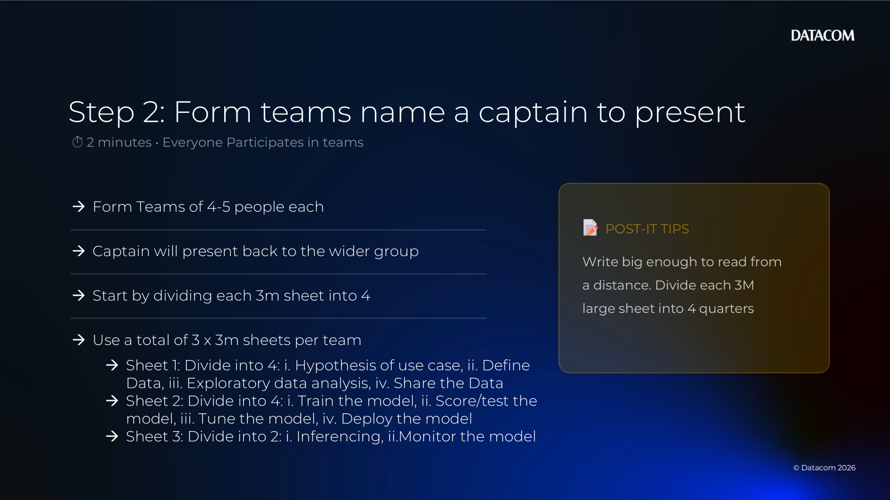
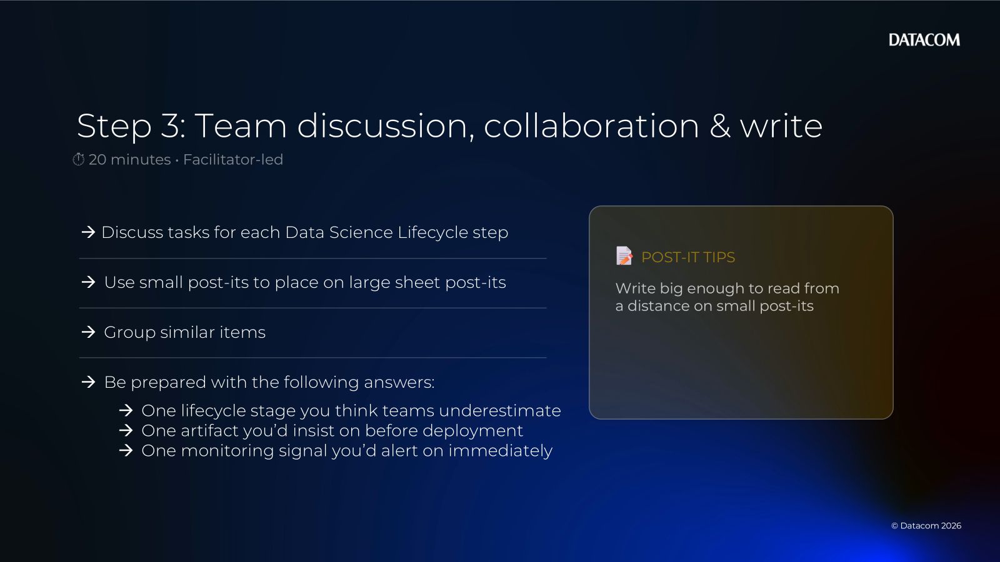
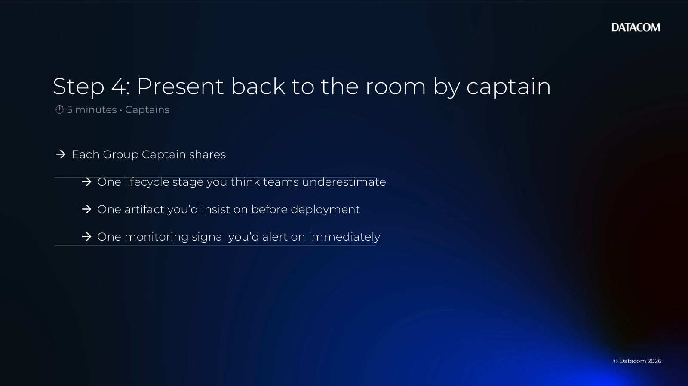

# Chapter 06 — Activity 1 (Training Layer: Lifecycle Tasks)

[Back to all lab instructions](../../LAB_INSTRUCTIONS.md)

**Duration**: ~30 minutes (facilitated)

## Goal

For each stage of the **Data Science lifecycle**, list the **real tasks/activities** your team would perform and map them to the **Training Layer** and surrounding components shown in the Data Science Architecture.

By the end, you should have a practical “what do we actually do?” checklist from idea → monitoring.

## Learning outcomes

By the end of this activity you can:

- Describe the 10 stages of the Data Science lifecycle in practical, task-focused terms
- Identify key artifacts produced at each stage (docs, datasets, models, metrics)
- Map lifecycle work to the Sandpit architecture concepts (workbenches, storage, pipelines, serving, monitoring)
- Spot common risk points (data access, leakage, evaluation quality, drift)

## Prerequisites

| Item | Notes |
|---|---|
| Large 3M sheets | One per team (or per wall section) |
| Mini “post-it” notes | One idea/task per note |
| Markers | Thick enough to read from a distance |
| A sample use case (optional) | Choose something concrete (e.g., classification, forecasting, document extraction) |
| Capture method (optional) | Photo the sheets, or transcribe into a shared doc |

> Facilitator note: Keep this grounded in “what would we do on Monday?” not theory.

---

## The 10 lifecycle stages

Use this sequence for the activity:

1. Hypothesis of use case
2. Define data
3. Exploratory data analysis
4. Shape the data
5. Train the model
6. Score/test the model
7. Tune the model
8. Deploy the model
9. Inferencing
10. Monitor the model

---

## Activity steps

| Step | What you’ll do | Time |
|---:|---|---:|
| 1 | Think about the Data Science Lifecycle | 2 mins |
| 2 | Form teams of 4–5 and name a captain to speak | 2 mins |
| 3 | Team discussion, collaboration and note tasks for each step of the Data Science Lifecycle | 20 mins |
| 4 | Present back to the room by captain | 5 mins |
| 5 | Conclude any discussion | 1 min |

---

### 1) Think (2 minutes)

- [ ] Think about the **Data Science Lifecycle**.

### 2) Form (2 minutes)

- [ ] Form teams of **4–5**.
- [ ] Name a **captain** to speak.

### 3) Team (20 minutes)

Team discussion, collaboration and note tasks for each step of the Data Science Lifecycle.

How to run it (manual):

- [ ] On a large 3M sheet, write the 10 lifecycle stages across the top.
- [ ] Write **one task per small post-it** and place it under the correct stage.
- [ ] Use a second color of post-its (or marker) for **outputs/artifacts**.

Optional capture format (if you’re transcribing into a doc):

| Stage | Tasks (what you do) | Outputs (artifacts) |
|---|---|---|
| Hypothesis of use case |  |  |
| Define data |  |  |
| Exploratory data analysis |  |  |
| Shape the data |  |  |
| Train the model |  |  |
| Score/test the model |  |  |
| Tune the model |  |  |
| Deploy the model |  |  |
| Inferencing |  |  |
| Monitor the model |  |  |

---

#### Prompt bank (use if you get stuck)

If you want sample answers for each stage (facilitator appendix), see:

- [CHAPTER06_ACTIVITY01_APPENDIX_SAMPLES.md](CHAPTER06_ACTIVITY01_APPENDIX_SAMPLES.md)

Work stage-by-stage. For each stage, aim for:

- 3–6 concrete tasks (“do X”, “review Y”, “compare Z”)
- 2–4 tangible outputs (docs, datasets, configs, dashboards)

Use the prompt lists below to keep momentum.

#### 1) Hypothesis of use case (problem framing)

Tasks prompts:
- Define the decision to improve (what changes when the model is used?)
- Identify users and workflow impact (where does this fit?)
- Define success metrics (business + technical)
- Identify constraints (privacy, latency, cost, fairness)
- Define acceptance criteria and “human-in-the-loop” checks

Outputs prompts:
- One-page problem statement
- Assumptions list + risks
- Success metrics + baseline

Architecture touchpoints (examples):
- None required yet; align to what will be deployed/monitored later

#### 2) Define data

Tasks prompts:
- Identify data sources and owners
- Confirm access approvals and data classifications
- Define target/label and leakage risks
- Define data schema and key entities
- Plan train/validation/test split strategy

Outputs prompts:
- Data inventory + access notes
- Data dictionary / schema
- Label definition + sampling plan

Architecture touchpoints (examples):
- Data connections
- Object storage / cluster storage

#### 3) Exploratory data analysis (EDA)

Tasks prompts:
- Profile data quality (missingness, outliers, duplicates)
- Explore feature distributions and correlations
- Validate label quality / noise
- Identify bias and representativeness concerns

Outputs prompts:
- EDA notebook/report
- Data quality findings + fixes list
- First-pass feature ideas

Architecture touchpoints (examples):
- Project workbench (notebook/VS Code)
- Workbench container images (Python + libraries)

#### 4) Shape the data (feature engineering + preparation)

Tasks prompts:
- Clean/transform/encode features
- Handle missing values and outliers
- Build reusable preprocessing pipeline
- Version datasets and transformations

Outputs prompts:
- Prepared dataset(s) + version tags
- Feature pipeline code
- Train/val/test splits

Architecture touchpoints (examples):
- Object storage / cluster storage
- Pipelines tooling (if automated)

#### 5) Train the model

Tasks prompts:
- Choose baseline model approach
- Implement training code
- Track experiments (params, data version, code version)
- Manage compute needs (CPU/GPU)

Outputs prompts:
- Trained model artifact
- Training logs
- Experiment runs summary

Architecture touchpoints (examples):
- Workbench or pipeline runtime
- Container images (CPU/GPU)

#### 6) Score/test the model (evaluation)

Tasks prompts:
- Pick evaluation metrics aligned to the problem
- Run evaluation on held-out data
- Perform error analysis (where does it fail?)
- Check for leakage and overfitting

Outputs prompts:
- Metrics report (incl. baseline comparison)
- Confusion matrix / calibration / error slices
- “Go / no-go” recommendation

Architecture touchpoints (examples):
- Workbench runtime
- Pipelines (repeatable evaluation)

#### 7) Tune the model

Tasks prompts:
- Hyperparameter tuning strategy
- Feature iteration (add/remove/transform)
- Compare candidates and select champion
- Document trade-offs (accuracy vs cost/latency)

Outputs prompts:
- Best model candidate + config
- Tuning results (search space + findings)
- Updated risk notes

Architecture touchpoints (examples):
- Pipelines for repeatable tuning
- Compute scaling where needed

#### 8) Deploy the model

Tasks prompts:
- Package model + preprocessing as a deployable unit
- Define API contract and input validation
- Set resource requests/limits and scaling rules
- Define rollout plan and rollback strategy

Outputs prompts:
- Deployment config (manifests/route)
- Model endpoint definition
- Release notes + known limits

Architecture touchpoints (examples):
- Model serving (e.g., KServe)
- Platform runtimes

#### 9) Inferencing (using the model)

Tasks prompts:
- Integrate with calling application/workflow
- Manage authZ/authN and secrets
- Add input/output logging (with privacy controls)
- Define human review steps for low confidence

Outputs prompts:
- Client integration notes
- Inference request/response examples
- Logging/telemetry configuration

Architecture touchpoints (examples):
- Deployed model endpoint
- Service mesh / routes (if applicable)

#### 10) Monitor the model

Tasks prompts:
- Monitor service health (latency, errors, saturation)
- Monitor model quality (drift, performance proxy signals)
- Define alert thresholds and escalation
- Define retraining triggers and cadence

Outputs prompts:
- Dashboards + alerts
- Drift monitoring plan
- Retraining playbook

Architecture touchpoints (examples):
- Monitoring tooling (e.g., Prometheus)
- Ops runbooks and SLOs

### 4) Present (10 minutes)

Present back to the room by **captain**.

Each group shares:

- [ ] One lifecycle stage you think teams underestimate
- [ ] One artifact you’d insist on before deployment
- [ ] One monitoring signal you’d alert on immediately

### 5) Conclude (1 minute)

Conclude any discussion.

---

## Optional: Map to the architecture (if time remains)

Circle/highlight where each stage happens in the “Data Science Architecture” conceptually:

- **Project Workbenches**: interactive work (EDA, shaping, training, evaluation)
- **Object / Cluster storage**: data + artifacts storage
- **Pipelines**: repeatability (prep, train, evaluate, tune)
- **Model Serving/Monitoring**: deploy, inferencing, monitor

Then answer:

- [ ] What do we automate first (pipeline candidates)?
- [ ] Where do we need governance controls (data access, deployment approvals)?
- [ ] Where are the biggest failure risks (data leakage, evaluation gaps, drift)?

---

## Optional facilitator prompts

- “What would cause us to stop and not deploy?”
- “Which step is most expensive if we get it wrong?”
- “If a model starts drifting, what do we do first?”
- “Where does the Training Layer end and the Inference/Orchestration layers begin?”

**Activity completed**
