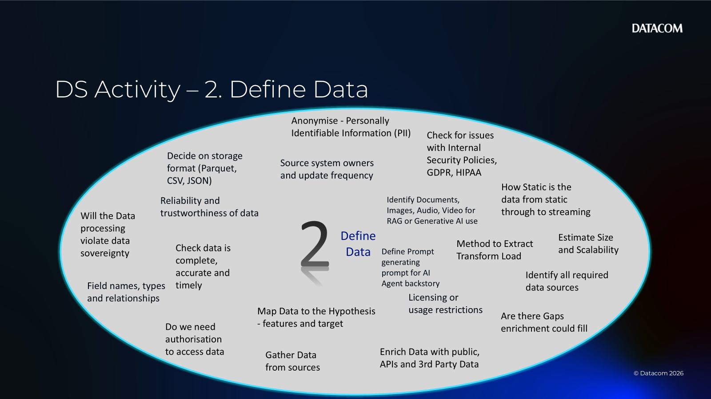
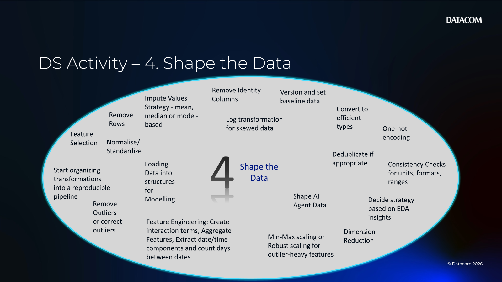
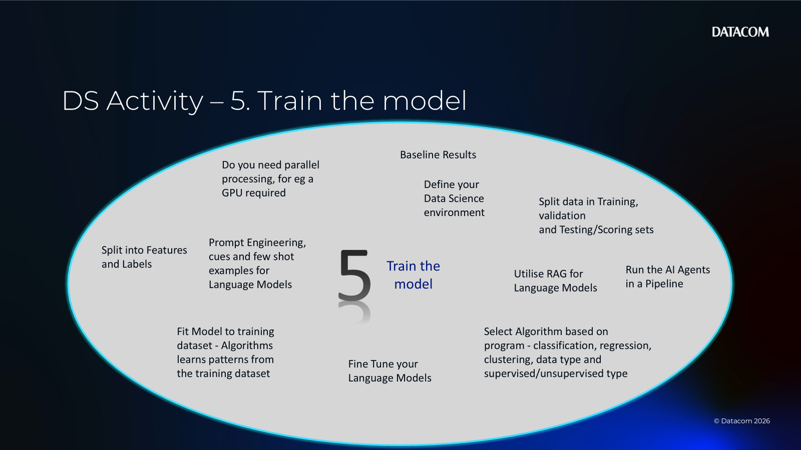
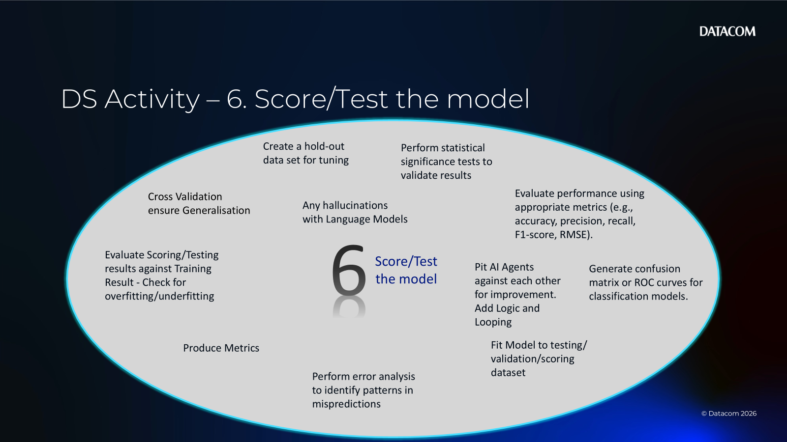
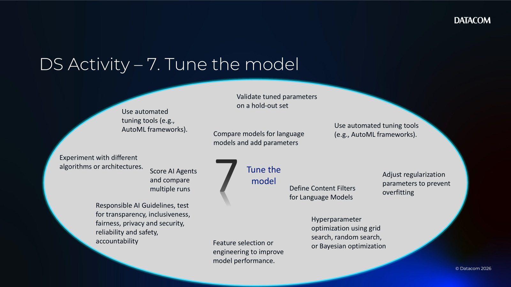
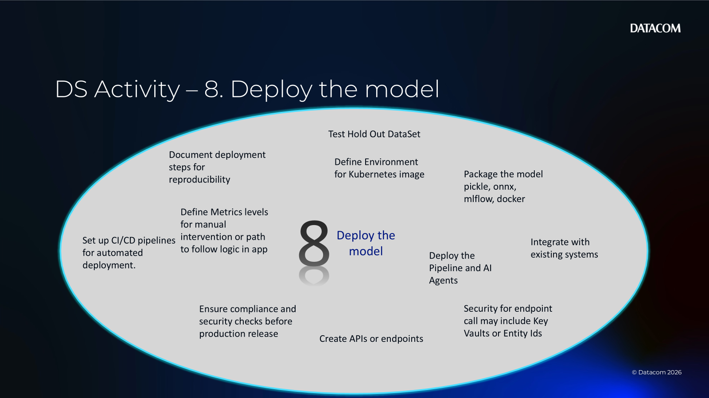
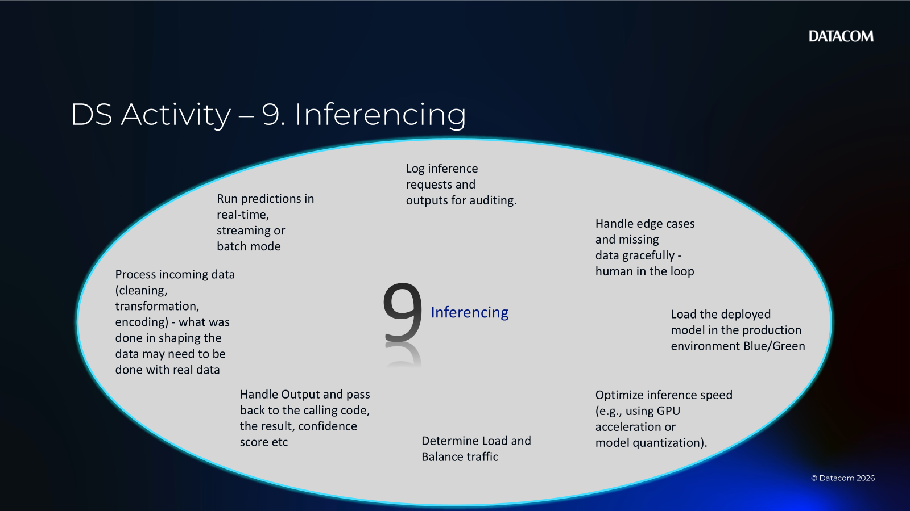
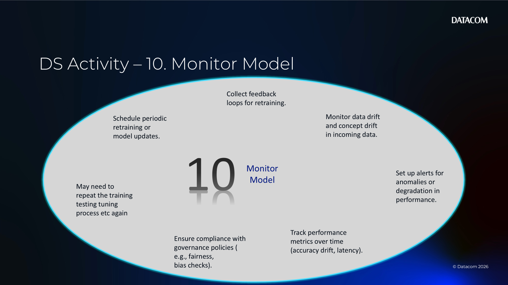

# Chapter 06 — Activity 1 (Facilitator Appendix: Sample Answers)

[Back to Activity 1](CHAPTER06_ACTIVITY01.md)

This appendix contains **example answers** teams can reference if they get stuck during Step 3 (Team discussion).

> Facilitator note: Use these as prompts/examples — don’t require exact wording.

---

## How to add the sample images

1. Save/export each sample slide as a PNG.
2. Copy it into `Chapter06/Activities/assets/`.
3. Use this naming convention:

- `sample-01-hypothesis-of-use-case.png`
- `sample-02-define-data.png`
- `sample-03-eda.png`
- `sample-04-shape-data.png`
- `sample-05-train-model.png`
- `sample-06-score-test-model.png`
- `sample-07-tune-model.png`
- `sample-08-deploy-model.png`
- `sample-09-inferencing.png`
- `sample-10-monitor-model.png`

---

## 1) Hypothesis of use case — sample

Quick prompts to read out:

- What problem are we solving and for whom?
- What is the expected outcome/KPI?
- What metric will we use to measure success?
- Is it supervised/unsupervised/generative/recommender?
- What’s the dependent variable / label?
- Do we have enough historical data and is it diverse?
- Any bias/gaps in the data?
- What’s still acceptable as manual work / where is human-in-the-loop?
- How often will we receive new data (daily/weekly/monthly)?
- What is the budget?

---

## 2) Define data — sample

---

## 3) Exploratory data analysis (EDA) — sample

---

## 4) Shape the data — sample

---

## 5) Train the model — sample

---

## 6) Score/test the model — sample

---

## 7) Tune the model — sample

---

## 8) Deploy the model — sample

---

## 9) Inferencing — sample

---

## 10) Monitor the model — sample

---

**Appendix completed**
