# Chapter 06 - Lab 1: Train a classification model from Jupyter Notebooks and Python

[Back to all lab instructions](../../LAB_INSTRUCTIONS.md)

**Duration**: ~40 minutes (hands-on)

Uncover an education prediction: will your students leave or stick it out?

## Goal

Run through a minimal, end-to-end **Training Layer** workflow in the Sandpit: start OpenShift AI, create a workbench, clone and run the lab notebook, train a baseline **classification** model, evaluate it, and save the resulting artifacts so the work is repeatable.

## Learning outcomes

By the end of this lab you can:

- Use a project workbench for interactive data science work
- Load a dataset and apply basic preparation steps
- Train a baseline model and capture evaluation metrics
- Save model artifacts + metadata so the work can be repeated and reviewed
- Explain where this lab sits in the lifecycle (Define/EDA/Shape/Train/Test)

## Prerequisites

| Item | Notes |
|---|---|
| Sandpit access | Cluster/console URL + credentials |
| A project/namespace | You can create or have one assigned |
| Workbench tooling | Jupyter/VS Code workbench available in your environment |
| Dataset | Use a safe dataset (public, synthetic, or facilitator-provided) |

---

## Lab steps

### Lab overview (timebox)

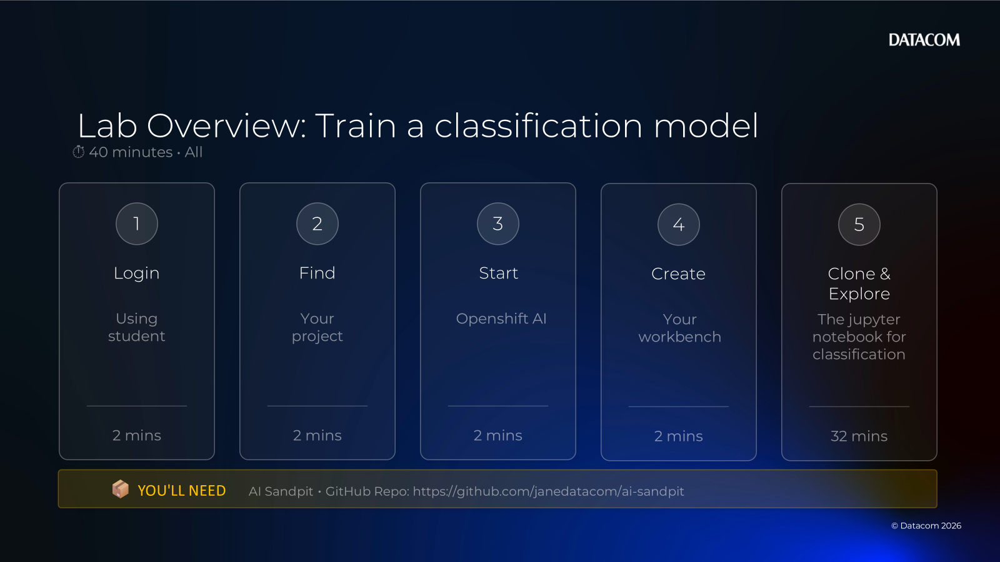

| Step | What you'll do | Time |
|---:|---|---:|
| 1 | Login (using student) | 2 mins |
| 2 | Find your project | 2 mins |
| 3 | Start OpenShift AI | 2 mins |
| 4 | Create your workbench | 2 mins |
| 5 | Clone & explore the Jupyter notebook for classification | 32 mins |

You'll need:
- AI Sandpit GitHub repo: https://github.com/janedatacom/ai-sandpit

---

### 1) Login (using student)

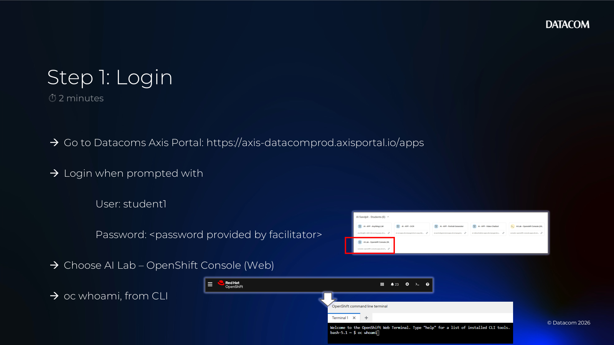

- [ ] Log in to the Sandpit / OpenShift console using the provided student credentials.

Capture:
- [ ] Cluster/console URL
- [ ] Username (or student identifier)

---

### 2) Find your project

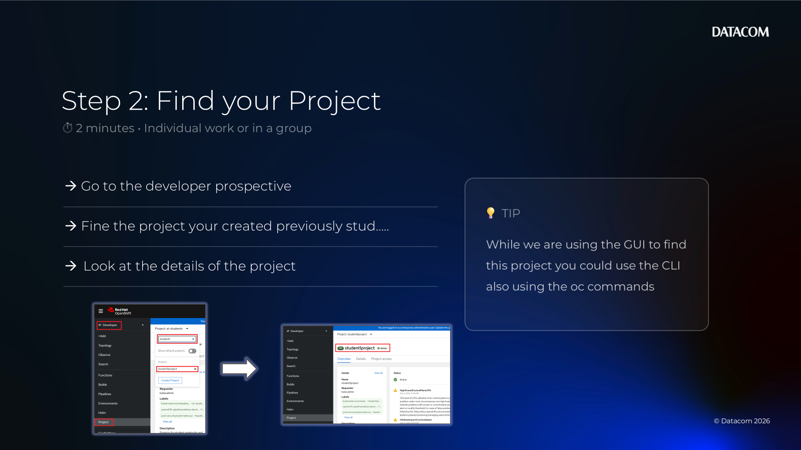

- [ ] Switch to your assigned project/namespace. You will be looking for student1project for eg. you created in a previous lab.

Screenshots (example flow):

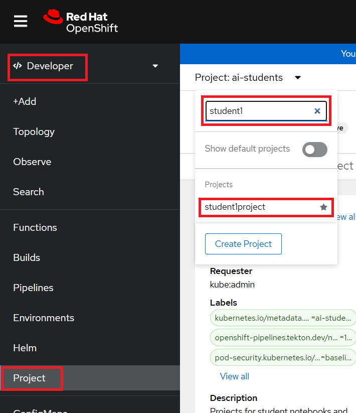

- [ ] Look at the details for the project

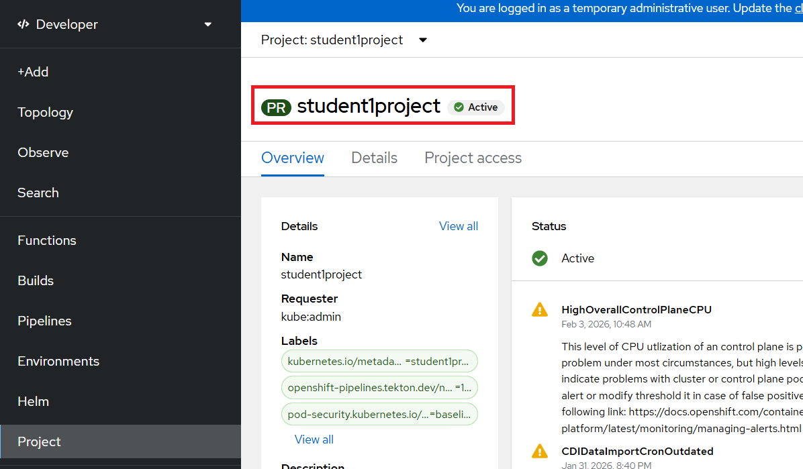

---

### 3) Start OpenShift AI

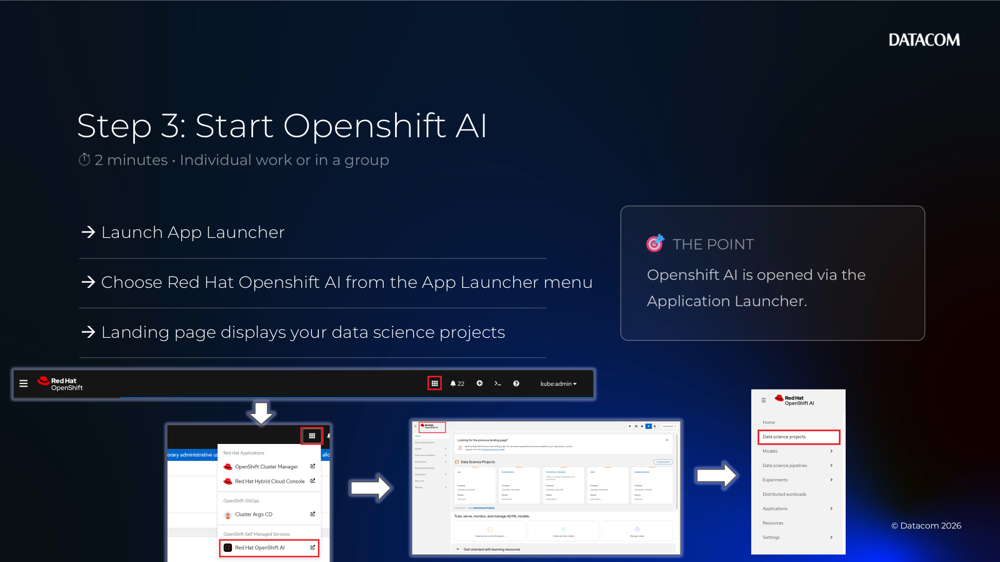

- [ ] From the Application Launcher (waffle menu), open **OpenShift AI**.


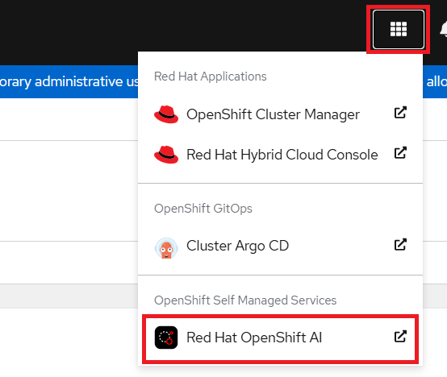

- [ ] You will be delivered to the landing page of the Data Science projects

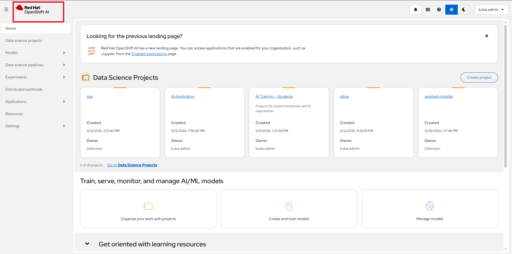

- [ ] Select your Data Science project.

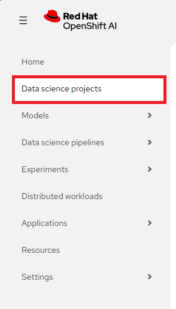

  If your Data Science project isn't visible / doesn't exist:


- [ ] you are create it - see what happens

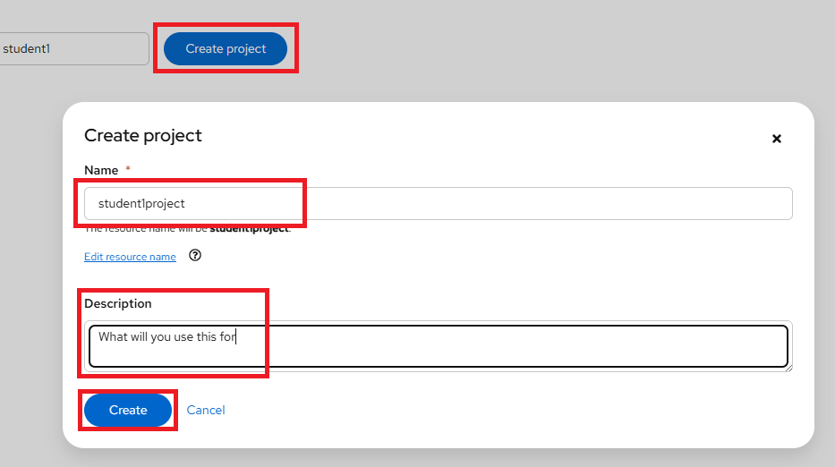

- [ ] Whoops duplicate project, the project you created earlier had a different name. This is the friendly name shown on this page rather than the technical name - so no need to create it again. Here is the project - make sure to choose it from the list using the name hyperlink

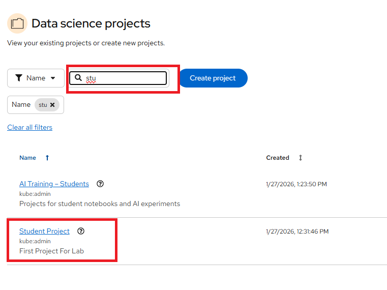

Capture:
- [ ] Project/namespace name

---

### 4) Create your workbench

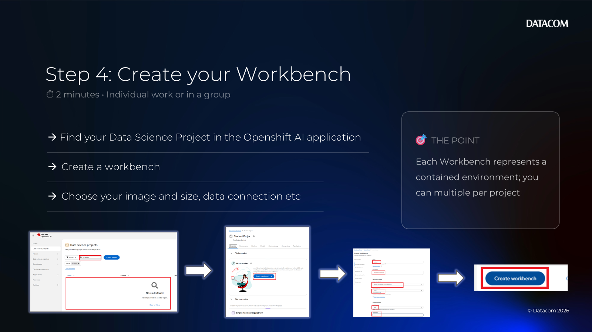

- [ ] Create and launch a **Project Workbench** (Jupyter).

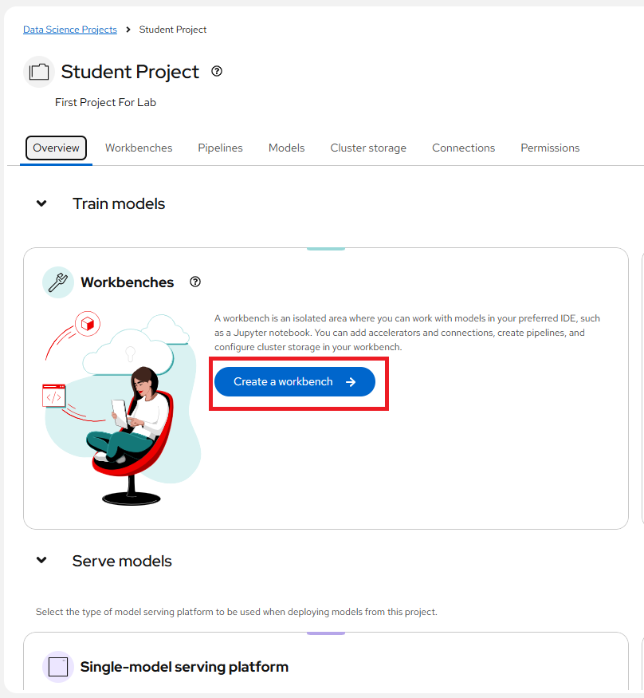

- [ ] Confirm the runtime has Python available. Give it a name like stud1wb1, a description, choose the image from the list or if adventurous create a new image. Choose the Version. I like to be on a slightly older version of python. Small deployment size with no accelerator. Everything else defaults.

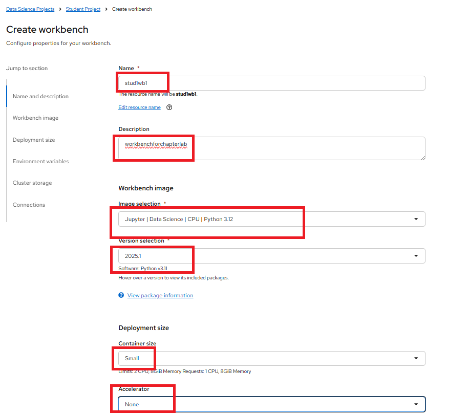

- [ ] Hit Create workbench button at the bottom of the screen


- [ ] Won't take long going from creating workbench to

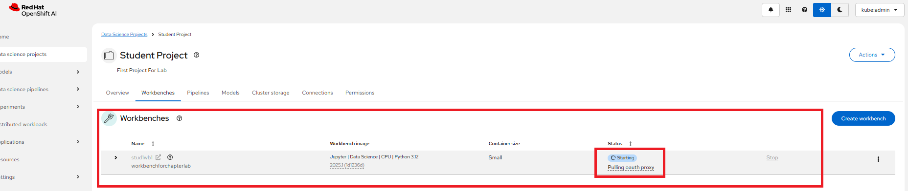

- [ ] Running workbench

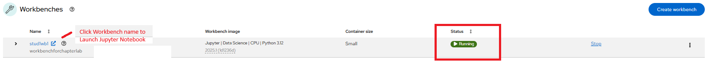

- [ ] Jupyter Notebooks will kick into action

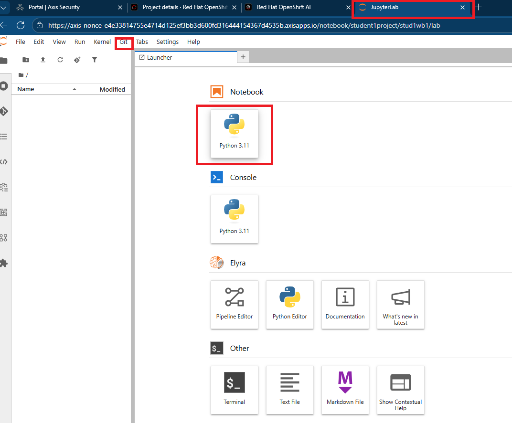

- [ ] Now we want to clone our lab from Github - lets take the whole repo

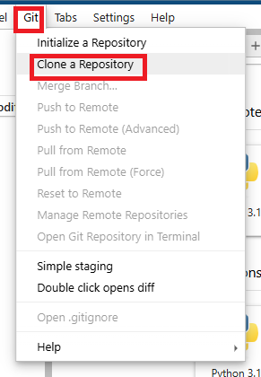

- [ ] Choose include submodules and download the repository
      Repository is: https://github.com/janedatacom/ai-sandpit

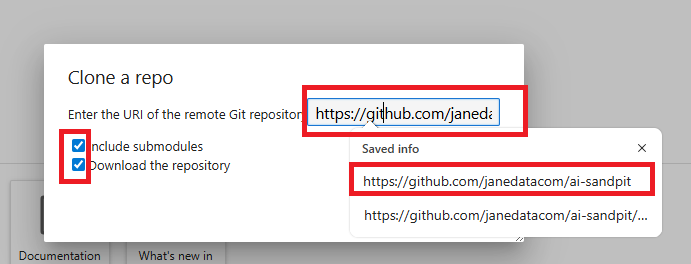

- [ ] Once you copied and pasted the repository in github, hit Clone

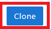

- [ ] Then you will see the top level directory of the AI Sandpit appear

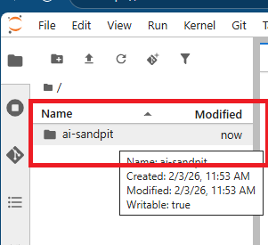

- [ ] You are ready to explore.

Suggested quick check (inside a notebook/terminal):

```bash
python --version
```
---

### 5) Clone & explore the Jupyter notebook for classification

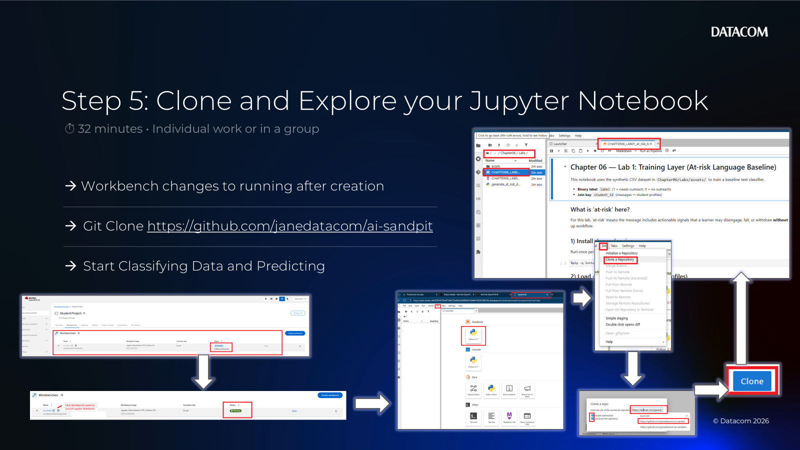

- [ ] Open the Chapter 6 lab notebook and run it end-to-end. Traverse down the directory and sub directories till you see Chapter 6/Labs, open the .ipynb (stands for ipython notebook the original name of Jupyter Notebook). There is also a AI sythesised dataset for you to look at - its a csv

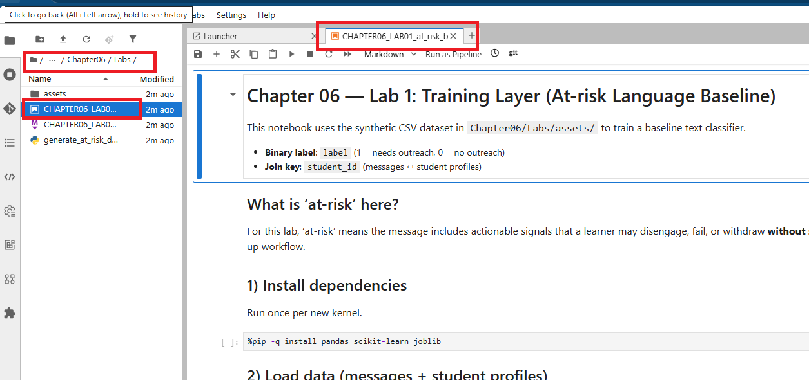

- [ ] Become familiar with the menu items at the top of Jupyter Lab
- [ ] Create new cells
- [ ] Run each cell
- [ ] Change the order of cells
- [ ] Which version of python can you see in the top right corner
- TIP: When looking at a new Notebook, it better to run each cell at a time, not run all at once - which is an option. You never know some items can run in the background on clusters in parallel but may appear completed until you run the next cell that relies on the completion. That will cause an error. Sometimes the lab will clear up after itself - you don't want to delete before you have even begun to understand what is happening. Observe you have a long running cell - what happens. Now lets get into the Data Science side of things and put into actions some of the those tasks you listed in the previous activity in this chapter.

A little about this use case. This data was generated by GPT-5.2. It shows reasons why students may drop out of a course for eg. We won't to try and look for signs and then predict if a student will drop out. This is done by looking at historical data of such occurances and other occurances like student completes the course. The tell-tail signs may indicate a risk to the student, like failure or drop out. The model will be trained on the historical data and then when we want to predict future occurances, we can throw new data at it. But first Exploratory Data Analysis

#### 5a) Load a dataset and run quick EDA

Use one of these options:

- Option A: facilitator-provided dataset location (recommended)
- Option B: a small public dataset copied into the workbench
- Option C: synthetic dataset generated in-code
- Option D: use the provided synthetic "at-risk language" CSVs in `Chapter06/Labs/assets/`

  - Messages: `at_risk_student_messages_500.csv` (text + label)
  - Student metadata (for joins): `at_risk_student_profiles.csv`

Tasks:
- [ ] Load dataset into a dataframe
- [ ] Inspect shape, column types, missing values
- [ ] Identify the target/label column (if supervised)

Capture:
- [ ] Dataset source/location
- [ ] Target/label definition
- [ ] Any quality issues found

---

#### 5b) Shape data + train a baseline model

Tasks (keep it simple):
- [ ] Split into train/test (and validation if needed)
- [ ] Basic preparation: encoding, scaling, missing value handling
- [ ] Train a baseline model (e.g., logistic regression / random forest)

Capture:
- [ ] What baseline model you chose and why
- [ ] Key preprocessing choices

---

#### 5c) Evaluate (score/test) and capture results

Tasks:
- [ ] Evaluate on held-out test data
- [ ] Record at least one primary metric and one diagnostic view

Examples:
- Classification: accuracy, precision/recall, confusion matrix
- Regression: MAE/RMSE, residuals plot

Capture:
- [ ] Metrics
- [ ] 2–3 example errors/failures (what does the model struggle with?)

---

#### 5d) Save artifacts (model + metrics)

Goal: make the outcome shareable and repeatable.

Tasks:
- [ ] Save the trained model artifact (e.g., pickle/onnx)
- [ ] Save a small `metrics.json` (and optionally `params.json`)
- [ ] Save the dataset version reference used for training

Where to store (pick what your environment supports):
- Object storage bucket/path
- Project storage (PVC)
- Git repo folder (small artifacts only)

Capture:
- [ ] Artifact location(s)
- [ ] What someone would need to reproduce the run (data version + code)

---

## Reflection (optional, 2 minutes)

- [ ] Which lifecycle stages did you complete in this lab?
- [ ] What would you automate next (pipeline candidate)?
- [ ] What would you require before deploying this model?

**Lab completed**
